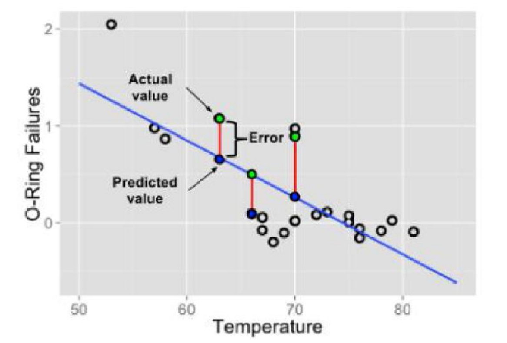
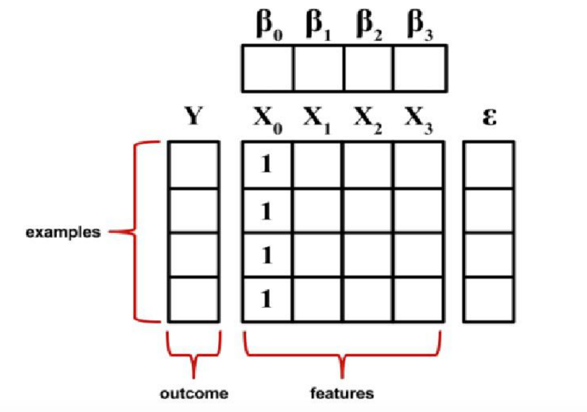

# 线性回归
1. 线性回归是机器学习中有监督机器学习下的一种算法
2. 回归问题主要关注确定一个唯一的因变量(dependent variable)(需要预测的值)和一个或多个数值型的自变量(independent variables)(预测变量)之间的关系。
3. 需要预测的值：即目标变量，target，y，连续值
4. 相关概念: 
    1. Actual value: 真实值，符号 $ y $
    2. Predicted value: 预测值，符号 $ \hat{y} $, 称为 y-hat, 把已知的x代入公式里和猜出来的a,b计算得到的
    3. Error: 误差，预测值和真实值的差距
    4. 最优解: 尽可能的找到一个模型使得整体的误差最小，整体的误差通常叫做损失Loss
    5. 拟合方程: 
    6. Loss: 整体的误差，loss 通过损失函数 loss function 计算得到
    7. 损失函数: MSE = $\frac{1}{m}\sum_{i=1}^m(y_i-\hat{y})^2 $
        - 损失函数 与 方差公式 $ \sigma^2=\frac{1}{N}\sum_{i=1}^N (x_i-\mu)^2 $ 较为相似
        - 损失函数：是机器学习模型训练的核心指标，用于衡量模型预测值（ŷ）与真实值（y）之间的差异程度
        - 方差（Variance）：是概率论和统计学中的概念，用于刻画随机变量（或一组数据）在其数学期望（平均值）附近的散布程度或离散程度
## 一元线性回归(简单线性回归)
1. 方程 $y = a +bx $
    1. a: 截距
    2. b: 斜率
    
## 多元线性回归
1. 方程: $$ y = \beta_0 + \beta_1 x_1 + \beta_2 x_2 + \cdots + \beta_p x_p + \epsilon $$
    1. $\beta_0$: 截距
    2. $\beta_1、\beta_2...\beta_p$: X的权重(Slope)，数学中称为斜率
    3. $x_1、x_2...x_p$: 预测变量(Predictor)
    
## Python 代码中的多元线性方程
1. Sklearn
```jupyter
import numpy as np
from sklearn.linear_model import LinearRegression

# 构建真实数据
X1 = 2 * np.random.rand(100, 1)
X2 = 2 * np.random.rand(100, 1)
X = np.c_[X1, X2]
y = 4 + 3 * X1 + 5 * X2 + np.random.randn(100, 1)
# 使用线性回归类创建对象
lin_reg = LinearRegression()
# 填充数据
lin_reg.fit(X, y)

print(lin_reg.intercept_, lin_reg.coef_)
```