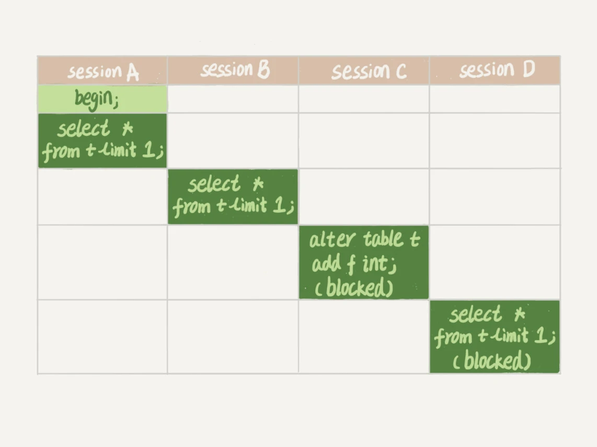
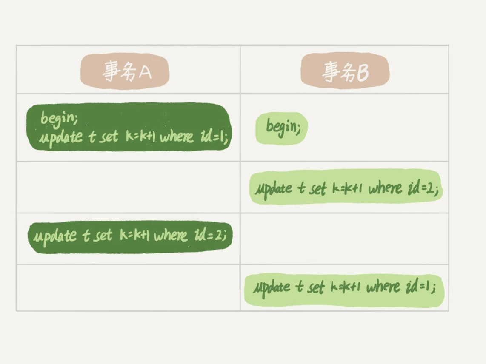

## Mysql 数据库锁
Mysql锁的分类: 全局锁、表级锁和行锁
### 全局锁
全局锁就是对整个数据库实例加锁
1. 命令: Flush tables with read lock(FTWRL)
    - 让整个库处于只读状态的时候，可以使用这个命令，之后其他线程的以下语句会被阻塞：数据更新语句（数据的增删改）、数据定义语句（包括建表、修改表结构等）和更新类事务的提交语句。
2. 使用场景: 做全库逻辑备份
    - 逻辑备份的其它方案对比:
        1. 使用 set global readonly=true (不推荐用来做备份库，原因如下)
            - 一是，在有些系统中，readonly 的值会被用来做其他逻辑，比如用来判断一个库是主库还是备库。因此，修改 global 变量的方式影响面更大，我不建议你使用。
            - 二是，在异常处理机制上有差异。如果执行 FTWRL 命令之后由于客户端发生异常断开，那么 MySQL 会自动释放这个全局锁，整个库回到可以正常更新的状态。而将整个库设置为 readonly 之后，如果客户端发生异常，则数据库就会一直保持 readonly 状态，这样会导致整个库长时间处于不可写状态，风险较高。
        2. mysqldump 使用参数–single-transaction
            - single-transaction 方法只适用于所有的表使用事务引擎的库
### 表级锁
表级别的锁有两种：一种是表锁，一种是元数据锁（meta data lock，MDL)
1. 表锁
    1. 表锁命令: lock tables … read/write
    2. 表锁释放注意: lock tables 语法除了会限制别的线程的读写外，也限定了本线程接下来的操作对象。
    3. 举例说明: 如果在某个线程 A 中执行 lock tables t1 read, t2 write; 这个语句，则其他线程写 t1、读写 t2 的语句都会被阻塞。同时，线程 A 在执行 unlock tables 之前，也只能执行读 t1、读写 t2 的操作。连写 t1 都不允许，自然也不能访问其他表。
    4. 表锁一般是在数据库引擎不支持行锁的时候才会被用到的
2. 元数据锁 MDL（metadata lock) (Mysql 5.5引入)
    1. MDL 不需要显式使用，在访问一个表的时候会被自动加上。
    2. MDL作用: 保证读写的正确性
    3. 当对一个表做增删改查操作的时候，加 MDL 读锁；当要对表做结构变更操作的时候，加 MDL 写锁。
        - 读锁之间不互斥，因此你可以有多个线程同时对一张表增删改查。
        - 读写锁之间、写锁之间是互斥的，用来保证变更表结构操作的安全性。因此，如果有两个线程要同时给一个表加字段，其中一个要等另一个执行完才能开始执行。
    4. 业务场景使用分析:
        1. 给表加字段
            - 一般方式
                
                - session A 先启动，这时候会对表 t 加一个 MDL 读锁。由于 session B 需要的也是 MDL 读锁，因此可以正常执行
                - 之后 session C 会被 blocked，是因为 session A 的 MDL 读锁还没有释放，而 session C 需要 MDL 写锁，因此只能被阻塞。
                - 之后所有要在表 t 上新申请 MDL 读锁的请求也会被 session C 阻塞。
                - 客户端有重试机制，也就是说超时后会再起一个新 session 再请求的话，这个库的线程很快就会爆满。
            - 推荐方式
                1. 解决长事务，事务不提交，就会一直占着 MDL 锁。在 MySQL 的 information_schema 库的 innodb_trx 表中查到当前执行中的事务。如果你要做 DDL 变更的表刚好有长事务在执行，要考虑先暂停 DDL，或者 kill 掉这个长事务。
                2. 变更的表是一个热点表，虽然数据量不大，但是上面的请求很频繁，在 alter table 语句里面设定等待时间，如果在这个指定的等待时间里面能够拿到 MDL 写锁最好，拿不到也不要阻塞后面的业务语句，先放弃。之后开发人员或者 DBA 再通过重试命令重复这个过程。
                    ```sql
                    /* MariaDB Support */
                    ALTER TABLE tbl_name NOWAIT add column ...
                    ALTER TABLE tbl_name WAIT N add column ...
                    ```
            - 注: Mysql 5.6支持Online DDL，流程为 Online DDL的过程是这样的：1. 拿MDL写锁 -> 2. 降级成MDL读锁 -> 3. 真正做DDL -> 4. 升级成MDL写锁 ->5. 释放MDL锁，此方式不能从根本上解决加字段锁表的问题。因为在图中第一步就会拿不到锁。
### 行锁
- 行锁由各个Mysql引擎实现，InnoDB 是支持行锁，MyISAM引擎就不支持行锁。
- 行锁就是针对数据表中行记录的锁。
    - 事务 A 更新了一行，而这时候事务 B 也要更新同一行，则必须等事务 A 的操作完成后才能进行更新。
- 在 InnoDB 事务中，行锁是在需要的时候才加上的，但并不是不需要了就立刻释放，而是要等到事务结束时才释放。这个就是两阶段锁协议。


### 死锁和死锁检测
当并发系统中不同线程出现循环资源依赖，涉及的线程都在等待别的线程释放资源时，就会导致这几个线程都进入无限等待的状态，称为死锁。

事务 A 在等待事务 B 释放 id=2 的行锁，而事务 B 在等待事务 A 释放 id=1 的行锁。 事务 A 和事务 B 在互相等待对方的资源释放，就是进入了死锁状态。
- 死锁策略:
    1. 一种策略是，直接进入等待，直到超时。这个超时时间可以通过参数 innodb_lock_wait_timeout(默认值是 50s) 来设置。
       - innodb_lock_wait_timeout 代表当出现死锁以后，第一个被锁住的线程要过 50s 才会超时退出，然后其他线程才有可能继续执行。
    2. 另一种策略是，发起死锁检测，发现死锁后，主动回滚死锁链条中的某一个事务，让其他事务得以继续执行。将参数 innodb_deadlock_detect 设置为 on，表示开启这个逻辑。
- 死锁场景问题分析
    1. 怎么解决由这种热点行更新导致的性能问题呢？(百万级更新场景，死锁检测要耗费大量的 CPU 资源)
        1. 一种头痛医头的方法，就是如果你能确保这个业务一定不会出现死锁，可以临时把死锁检测关掉。
        2. 另一种方式控制并发度，同一行同时最多只有 10 个线程在更新，那么死锁检测的成本很低，就不会出现这个问题。(在数据库服务端处理，比如利用proxy)
