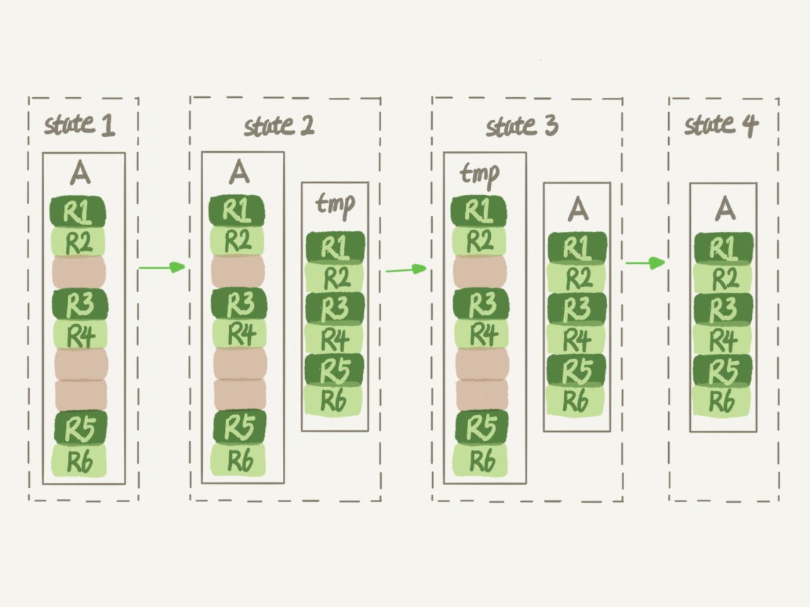
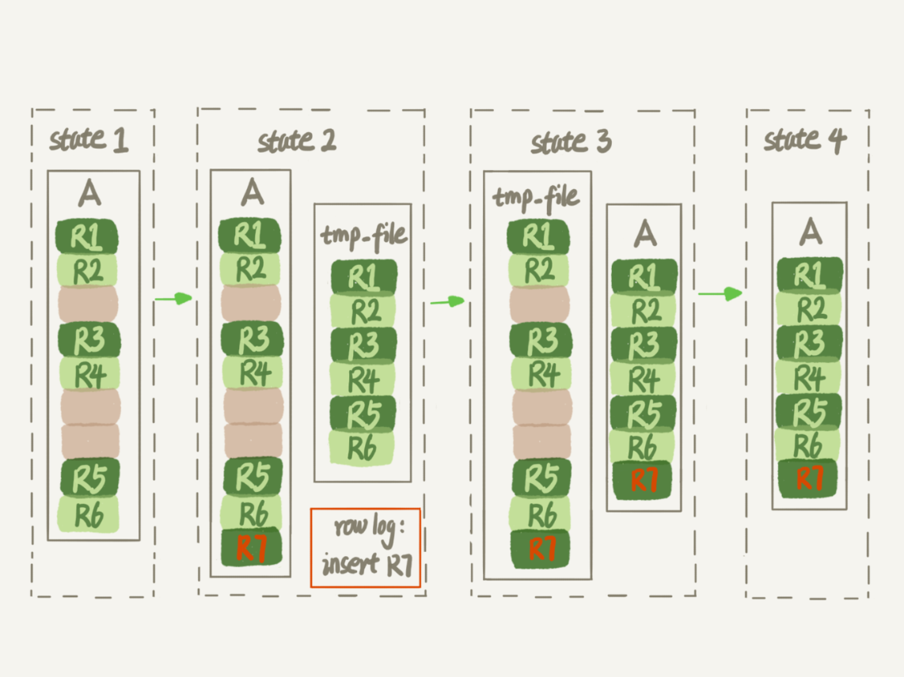

# Mysql
## Mysql 安装
1. install mysql url:

2. 启动mysql
```
/usr/local/mysql/bin/mysqld
/usr/local/mysql/bin/mysql -u root -p
/usr/local/mysql/bin/mysql -u root -p --protocol=tcp --host=localhost --port=3307    --通过TCP连接管理不同端口的多个MySQL
/usr/local/mysql/bin/mysql -u root -p --socket=/tmp/mysql3307.sock                   --通过socket套接字管理不同端口的多个MySQL
```

## Mysql 规范
1. 表名: tbl_xxx_xxx
2. 视图名: view_xxx_xxx
3. 索引名: seq_xxx_xxx
4. 包名: pkg_xxx_xxx
5. 存储过程名：
6. 案例:
    - 地区表 address表
		- addressId             地区编号
		- addressName           地区名称
		- addressIndexId        地区索引
		- addressParentId       父层地区编号

## 数据库引擎: (blog: https://www.cnblogs.com/0201zcr/p/5296843.html)
1. 设置Mysql数据库引擎: 通过my.ini文件设置数据库引擎: default-storage-engine=InnoDB
	通过设置表的类型 type=MyISAM  设置数据库表使用的引擎
2. Mysql数据库引擎类别
	1. InnoDB(推荐)：
	   	1. 特性：
			- 支持事务处理等
			- 不加锁读取
			- 支持外键
			- 支持行锁
			- 不支持FULLTEXT类型的索引
			- 不保存表的具体行数，扫描表来计算有多少行
			- DELETE 表时，是一行一行的删除
			- InnoDB 把数据和索引存放在表空间里面
			- 跨平台可直接拷贝使用
			- InnoDB中必须包含AUTO_INCREMENT类型字段的索引
			- 表格很难被压缩
		2. 使用场景: 
			
	2. MyISAM：
		1. 特性：
			- 不支持事务，回滚将造成不完全回滚，不具有原子性
			- 不支持外键
			- 支持全文搜索
			- 保存表的具体行数,不带where时，直接返回保存的行数
			- DELETE 表时，先drop表，然后重建表
			- MyISAM 表被存放在三个文件 。frm 文件存放表格定义。 数据文件是MYD (MYData) 。 索引文件是MYI (MYIndex)引伸
			- 跨平台很难直接拷贝
			- MyISAM中可以使AUTO_INCREMENT类型字段建立联合索引
			- 表格可以被压缩
		2. 使用场景:

## Mysql 表结构
1. Mysql InnoDB:包含两部分，表结构定义和数据
2. 表结构: MySQL 8.0 版本以前，表结构是存在以.frm 为后缀的文件里，MySQL 8.0 版本，把表结构定义放在系统数据表中，因为表结构定义占用的空间很小。
3. 表数据: 表数据既可以存在共享表空间里(表drop删除，空间也不会回收。)，也可以是单独的文件。这个行为是由参数 innodb_file_per_table 控制。(OFF 系统共享表空间/ON 表示存储在以 .ibd 为后缀的文件)
4. 表数据存储空洞
    1. 删除记录时，InnoDB 引擎只会把记录标记为删除，如果再插入对应B+树区间的值时，可能会复用此空间，磁盘文件的大小并不会缩小。
    2. 插入记录时，如果数据是按照索引递增顺序插入的，那么索引是紧凑的。但如果数据是随机插入的，就可能造成索引的数据页分裂。
    
    3. 更新记录时，会更新索引上的值，可以理解为删除一个旧的值，再插入一个新值，也可能造成空洞。
5. 解决表存储空间空洞问题
    1. 重建表
        1. Mysql 5.5版本
            - 新建一个与表 A 结构相同的表 B，然后按照主键 ID 递增的顺序，把数据一行一行地从表 A 里读出来再插入到表 B 中。 由于表 B 是新建的表，所以表 A 主键索引上的空洞，在表 B 中就都不存在了。显然地，表 B 的主键索引更紧凑，数据页的利用率也更高。如果我们把表 B 作为临时表，数据从表 A 导入表 B 的操作完成后，用表 B 替换 A，从效果上看，就起到了收缩表 A 空间的作用。
            - 使用 alter table A engine=InnoDB 命令来重建表。（MySQL 5.5 版本前），该操作与上述描述执行流程一致，MySQL 会自动完成转存数据、交换表名、删除旧表的操作。
            
            - 如果在这个过程中，有新的数据要写入到表 A 的话，就会造成数据丢失。表 A 中不能有更新。此操作非Online。
    2. Mysql 5.6版本(推荐使用 Github开源的gh-ost做)
        1. 建立一个临时文件，扫描表 A 主键的所有数据页；
        2. 用数据页中表 A 的记录生成 B+ 树，存储到临时文件中；
        3. 生成临时文件的过程中，将所有对 A 的操作记录在一个日志文件（row log）中，对应的是图中 state2 的状态；
        4. 临时文件生成后，将日志文件中的操作应用到临时文件，得到一个逻辑数据上与表 A 相同的数据文件，对应的就是图中 state3 的状态；
        5. 用临时文件替换表 A 的数据文件。
        6. 注意其最终命令还是 alter table t engine = InnoDB，只不过新的Mysql版本在原有基础上做了优化。
        
6. Online 和 inplace的区别？
    1. Mysql5.5及之前版本，表 A 中的数据导出来的存放位置叫作 tmp_table。这是一个临时表，是在 server 层创建的
    2. Mysql5.6版本，根据表 A 重建出来的数据是放在“tmp_file”里的，这个临时文件是 InnoDB 在内部创建出来的。整个 DDL 过程都在 InnoDB 内部完成。对于 server 层来说，没有把数据挪动到临时表，是一个“原地”操作，这就是“inplace”名称的来源。
    3. 假设: 如果你有一个 1TB 的表，现在磁盘间是 1.2TB，能不能做一个 inplace 的 DDL 呢？ 答: 不能，tmp_file 也是要占用临时空间的。
    4. 重建表的这个语句 alter table t engine=InnoDB，其实隐含意思为
        ```sql
        alter table t engine=innodb,ALGORITHM=inplace;
        /* inplace 对应的就是拷贝copy 表方式 */
        alter table t engine=innodb,ALGORITHM=copy;
    ```
    5. Oneline 与inplace的关系
        1. DDL 过程如果是 Online 的，就一定是 inplace 的
        2. 反过来未必，也就是说 inplace 的 DDL，有可能不是 Online 的。截止到 MySQL 8.0，添加全文索引（FULLTEXT index）和空间索引 (SPATIAL index) 就属于这种情况。

## Mysql 优化器
优化器选择索引的目的是找到一个最优的执行方案，并用最小的代价去执行语句。在数据库里面，扫描行数是影响执行代价的因素之一。扫描的行数越少，意味着访问磁盘数据的次数越少，消耗的CPU资源越少。
1. 优化器因素:
    1. 扫描行数
    2. 是否使用临时表
    3. 是否排序
2. 优化器
    1. MySQL 在真正开始执行语句之前，并不能精确地知道满足这个条件的记录有多少条，而只能根据统计信息来估算记录数。统计信息为索引的“区分度”。
      一个索引上不同的值越多，这个索引的区分度就越好。而一个索引上不同的值的个数，我们称之为“基数”（cardinality）。也就是说，这个基数越大，索引的区分度越好。
    2. Mysql采样统计：InnoDB 默认会选择 N 个数据页，统计这些页面上的不同值，得到一个平均值，然后乘以这个索引的页面数，就得到了这个索引的基数。当变更的数据行数超过 1/M 的时候，会自动触发重新做一次索引统计。
    3. 两种存储索引统计的方式，可以通过设置参数 innodb_stats_persistent 的值来选择：
        1. 设置为 on 的时候，表示统计信息会持久化存储。这时，默认的 N 是 20，M 是 10。
        2. 设置为 off 的时候，表示统计信息只存储在内存中。这时，默认的 N 是 8，M 是 16。
3. 案例
    1. 两个事务，删除数据，再重新插入数据
    
        - 执行结果: session B 的查询语句 select * from t where a between 10000 and 20000 就不会再选择索引 a 了
    2. 排序数据
        ```sql
    /* 优化器选择使用索引 b，是因为它认为使用索引 b 可以避免排序（b 本身是索引，已经是有序的了，如果选择索引 b 的话，不需要再做排序，只需要遍历） */
    select * from t where a between 1 and 5000 order by b limit 1
    /* 要求按照 b,a 排序，就意味着使用这两个索引都需要排序。扫描行数成了影响决策的主要条件 */
    select * from t where a between 1 and 5000 order by b,a limit 1
    ```


          
