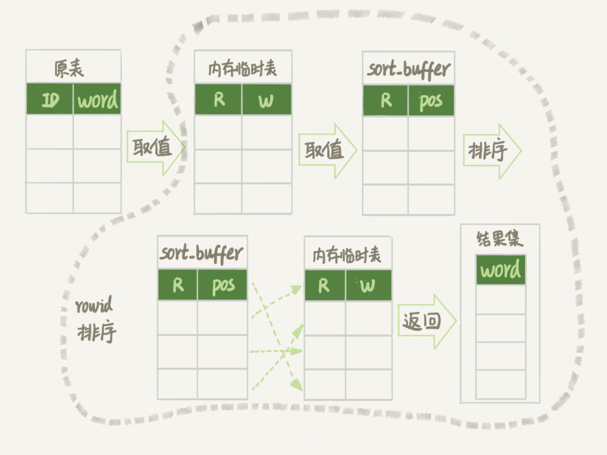

## Mysql 查询
1. Mysql 查询时，锁的影响？
   1. Mysql 查询时，会持有 MDL 元数据读锁，与元数据写锁，存在冲突。

#### Mysql Select Count(*)
1. 在不同的 MySQL 引擎中，count(*) 有不同的实现方式。
   - MyISAM 引擎把一个表的总行数存在了磁盘上，因此执行 count(*) 的时候会直接返回这个数，效率很高；
   - InnoDB 引擎执行 count(*) 的时候，需要把数据一行一行地从引擎里面读出来，然后累积计数。
2. InnoDB为什么不把Count(*)数字存起来呢?
    1. 多版本并发控制（MVCC
    
        - 三个会话 A、B、C 会同时查询表 t 的总行数,但结果却不同。
    2. InnoDB 可重复读是它默认的隔离级别，在代码上就是通过多版本并发控制，也就是 MVCC 来实现的。每一行记录都要判断自己是否对这个会话可见，因此对于 count(*) 请求来说，InnoDB 只好把数据一行一行地读出依次判断，可见的行才能够用于计算“基于这个查询”的表的总行数。
3. InnoDB 是索引组织表，主键索引树的叶子节点是数据，而普通索引树的叶子节点是主键值。所以，普通索引树比主键索引树小很多。MySQL 优化器会找到最小的那棵树来遍历。在保证逻辑正确的前提下，尽量减少扫描的数据量，是数据库系统设计的通用法则之一。
4. show table status，输出结果的TABLE_ROWS 通过采样估算得来的，与Count(*)不同。
5. 不同的 count 用法的差别？
    1. count() 是一个聚合函数，对于返回的结果集，一行行地判断，如果 count 函数的参数不是 NULL，累计值就加 1，否则不加。最后返回累计值。
    2. count(*)、count(主键 id) 和 count(1) 都表示返回满足条件的结果集的总行数；而 count(字段），则表示返回满足条件的数据行里面，参数“字段”不为 NULL 的总个数。
    3. 对于 count(主键 id) 来说，InnoDB 引擎会遍历整张表，把每一行的 id 值都取出来，返回给 server 层。server 层拿到 id 后，判断是不可能为空的，就按行累加。
    4. 对于 count(1) 来说，InnoDB 引擎遍历整张表，但不取值。server 层对于返回的每一行，放一个数字“1”进去，判断是不可能为空的，按行累加。
    5. count(*) 是例外，并不会把全部字段取出来，而是专门做了优化，不取值。count(*) 肯定不是 null，按行累加。故Mysql的Count(*)与Count(0)差异不大。
#### Mysql Order By
1. 全字段排序
```sql
explain select city,name,age from t where city='杭州' order by name limit 1000  ;
```
  - 注: Extra中的“Using filesort”表示的就是需要排序,MySQL 会给每个线程分配一块内存用于排序，称为 sort_buffer。

  - 语句执行流程
    1. 初始化 sort_buffer，确定放入 name、city、age 这三个字段；
    2. 从索引 city 找到第一个满足 city='杭州’条件的主键 id，也就是图中的 ID_X；
    3. 到主键 id 索引取出整行，取 name、city、age 三个字段的值，存入 sort_buffer 中；
    4. 从索引 city 取下一个记录的主键 id；
    5. 重复步骤 3、4 直到 city 的值不满足查询条件为止，对应的主键 id 也就是图中的 ID_Y；
    6. 对 sort_buffer 中的数据按照字段 name 做快速排序；按 name 排序”这个动作，可能在内存中完成，也可能需要使用外部排序，这取决于排序所需的内存和参数 sort_buffer_size。
    7. 按照排序结果取前 1000 行返回给客户端。
  - 判断排序语句是否使用了临时文件: 通过查看 OPTIMIZER_TRACE的结果，从 number_of_tmp_files 中确认是否使用了临时文件
    ```sql
      /* 打开optimizer_trace，只对本线程有效 */
      SET optimizer_trace='enabled=on';

      /* @a保存Innodb_rows_read的初始值 */
      select VARIABLE_VALUE into @a from  performance_schema.session_status where variable_name = 'Innodb_rows_read';

      /* 执行语句 */
      select city, name,age from t where city='杭州' order by name limit 1000;

      /* 查看 OPTIMIZER_TRACE 输出 */
      SELECT * FROM `information_schema`.`OPTIMIZER_TRACE`\G

      /* @b保存Innodb_rows_read的当前值 */
      select VARIABLE_VALUE into @b from performance_schema.session_status where variable_name = 'Innodb_rows_read';

      /* 计算Innodb_rows_read差值 */
      select @b-@a;
    ```
    - 注: number_of_tmp_files 表示的是，排序过程中使用的临时文件数,外部排序一般使用归并排序算法。
    - 假设number_of_tmp_files的数字12表示，MySQL 将需要排序的数据分成 12 份，每一份单独排序后存在这些临时文件中。然后把这 12 个有序文件再合并成一个有序的大文件。
    - sort_mode 中的 packed_additional_fields的意思为排序过程对字符串做了“紧凑”处理,按字段实际长度分配空间
    - 查询语句 select @b-@a，表示实际扫描的行数
2. rowid 排序
    - max_length_for_sort_data，是 MySQL 中专门控制用于排序的行数据的长度的一个参数。表示如果单行的长度超过这个值，MySQL 就认为单行太大，要换一个算法。
    ```sql
    SET max_length_for_sort_data = 16;
    ```
    - 执行流程
        1. 初始化 sort_buffer，确定放入两个字段，即 name 和 id
        2. 从索引 city 找到第一个满足 city='杭州’条件的主键 id，也就是图中的 ID_X；
        3. 到主键 id 索引取出整行，取 name、id 这两个字段，存入 sort_buffer 中
        4. 从索引 city 取下一个记录的主键 id；
        5. 重复步骤 3、4 直到不满足 city='杭州’条件为止，也就是图中的 ID_Y
        6. 对 sort_buffer 中的数据按照字段 name 进行排序；
        7. 遍历排序结果，取前 1000 行，并按照 id 的值回到原表中取出 city、name 和 age 三个字段返回给客户端。

3. 并不是所有的 order by 语句，都需要排序操作的。从上面分析的执行过程，我们可以看到，MySQL 之所以需要生成临时表，并且在临时表上做排序操作，其原因是原来的数据都是无序的。
4. 随机显示
    - 例: 英语学习 App 首页有一个随机显示单词的功能，也就是根据每个用户的级别有一个单词表，然后这个用户每次访问首页的时候，都会随机滚动显示三个单词。
    1. 方案1：order by rand()
        - order by rand() 这种写法都会让计算过程非常复杂，需要大量的扫描行数，因此排序过程的资源消耗也会很大。 
        1. 内存临时表
        ```sql
        explain select word from words order by rand() limit 3;
        ```
        - Extra 字段显示 Using temporary，表示的是需要使用临时表；Using filesort，表示的是需要执行排序操作。
        - 执行流程: 
            1. 创建一个临时表。这个临时表使用的是 memory 引擎，表里有两个字段，第一个字段是 double 类型，为了后面描述方便，记为字段 R，第二个字段是 varchar(64) 类型，记为字段 W。并且，这个表没有建索引。
            2. 从 words 表中，按主键顺序取出所有的 word 值。对于每一个 word 值，调用 rand() 函数生成一个大于 0 小于 1 的随机小数，并把这个随机小数和 word 分别存入临时表的 R 和 W 字段中，到此，扫描行数是 10000。
            3. 现在临时表有 10000 行数据了，接下来你要在这个没有索引的内存临时表上，按照字段 R 排序。
            4. 初始化 sort_buffer。sort_buffer 中有两个字段，一个是 double 类型，另一个是整型。
            5. 从内存临时表中一行一行地取出 R 值和位置信息（我后面会和你解释这里为什么是“位置信息”），分别存入 sort_buffer 中的两个字段里。这个过程要对内存临时表做全表扫描，此时扫描行数增加 10000，变成了 20000。
            6. 在 sort_buffer 中根据 R 的值进行排序。注意，这个过程没有涉及到表操作，所以不会增加扫描行数。
            7. 排序完成后，取出前三个结果的位置信息，依次到内存临时表中取出 word 值，返回给客户端。这个过程中，访问了表的三行数据，总扫描行数变成了 20003。
            
            - 注: pos是位置信息,
            - 每个引擎用来唯一标识数据行的信息。
            - 对于有主键的 InnoDB 表来说，这个 rowid 就是主键 ID；
            - 对于没有主键的 InnoDB 表来说，这个 rowid 就是由系统生成的；
            - MEMORY 引擎不是索引组织表。可以视他为数组，其rowid为数组的下标
        2. 磁盘临时表
            - 条件: tmp_table_size 这个配置限制了内存临时表的大小，默认值是 16M。如果临时表大小超过了 tmp_table_size，那么内存临时表就会转成磁盘临时表。
            - 磁盘临时表使用的引擎默认是 InnoDB，是由参数 internal_tmp_disk_storage_engine 控制的。
            - 当使用磁盘临时表的时候，对应的就是一个没有显式索引的 InnoDB 表的排序过程。
            ```sql
              /** 创造磁盘临时表的条件 **/
              set tmp_table_size=1024;
              set sort_buffer_size=32768;
              set max_length_for_sort_data=16;
      
              /* 打开 optimizer_trace，只对本线程有效 */
              SET optimizer_trace='enabled=on';

              /* 执行语句 */
              select word from words order by rand() limit 3;

              /* 查看 OPTIMIZER_TRACE 输出 */
              SELECT * FROM `information_schema`.`OPTIMIZER_TRACE`\G
            ```
            - 将 max_length_for_sort_data 设置成 16，小于 word 字段的长度定义，sort_mode 里面显示的是 rowid 排序，参与排序的是随机值 R 字段和 rowid 字段组成的行。
            - R 字段存放的随机值就 8 个字节，rowid 是 6 个字节，数据总行数是 10000，共有 140000 字节，，超过了 sort_buffer_size 定义的 32768 字节，
            - number_of_tmp_files 的值为 0，未使用临时文件，MySQL 5.6 版本引入的一个新的排序算法，即：优先队列排序算法。
            1. 优先队列算法，就可以精确地只得到三个最小值
                1. 对于这 10000 个准备排序的 (R,rowid)，先取前三行，构造成一个堆；（对数据结构印象模糊的同学，可以先设想成这是一个由三个元素组成的数组）
                2. 取下一个行 (R’,rowid’)，跟当前堆里面最大的 R 比较，如果 R’小于 R，把这个 (R,rowid) 从堆中去掉，换成 (R’,rowid’);
                3. 重复第 2 步，直到第 10000 个 (R’,rowid’) 完成比较。
                
    2. 方案2: 
        1. 取得这个表的主键 id 的最大值 M 和最小值 N;
        2. 用随机函数生成一个最大值到最小值之间的数 X = (M-N)*rand() + N;
        3. 取不小于 X 的第一个 ID 的行。
        ```sql
        select max(id),min(id) into @M,@N from t ;
        set @X= floor((@M-@N+1)*rand() + @N);
        select * from t where id >= @X limit 1;
        ```
        - 效率很高，因为取 max(id) 和 min(id) 都是不需要扫描索引的,select 也可以用索引快速定位,但不同行的概率不一样，
    3. 方案3:
        1. 取得整个表的行数，并记为 C。
        2. 取得 Y = floor(C * rand())。 floor 函数在这里的作用，就是取整数部分
        3. 再用 limit Y,1 取得一行。
        ```sql
        select count(*) into @C from t;
        set @Y = floor(@C * rand());
        set @sql = concat("select * from t limit ", @Y, ",1");
        prepare stmt from @sql;
        execute stmt;
        DEALLOCATE prepare stmt;
        ```
    4. 方案4
        1. 取得整个表的行数，记为 C；
        2. 根据相同的随机方法得到 Y1、Y2、Y3；
        3. 再执行三个 limit Y, 1 语句得到三行数据。
        ```sql
        select count(*) into @C from t;
        set @Y1 = floor(@C * rand());
        set @Y2 = floor(@C * rand());
        set @Y3 = floor(@C * rand());
        // 在应用代码里面取Y1、Y2、Y3值，拼出SQL后执行
        select * from t limit @Y1，1;
        select * from t limit @Y2，1;
        select * from t limit @Y3，1;
        ```

### 相同查询逻辑，性能分析
1. 条件字段函数操作
    - 案例: 交易系统,交易记录表 tradelog 包含交易流水号（tradeid）、交易员 id（operator）、交易时间（t_modified）
    ```sql
    CREATE TABLE `tradelog` (
      `id` int(11) NOT NULL,
      `tradeid` varchar(32) DEFAULT NULL,
      `operator` int(11) DEFAULT NULL,
      `t_modified` datetime DEFAULT NULL,
      PRIMARY KEY (`id`),
      KEY `tradeid` (`tradeid`),
      KEY `t_modified` (`t_modified`)
    ) ENGINE=InnoDB DEFAULT CHARSET=utf8mb4;
    ```
    1. 统计发生在所有年份中 7 月份的交易记录总数
        ```sql
        select count(*) from tradelog where month(t_modified)=7;
        ```
        - t_modified字段上有索引，但是对字段做了函数计算，就用不上索引，
        - 对索引字段做函数操作，可能会破坏索引值的有序性，因此优化器就决定放弃走树搜索功能。

2. 隐式类型转换
    ```sql
    select * from tradelog where tradeid=110717;
    ```
    - 交易编号 tradeid 存在索引，但是 explain 的结果却显示全表扫描。
    - tradeid 的字段类型是 varchar(32)，而输入的参数却是整型，所以需要做类型转换。
    1. 转换规则
        - 如果规则是“将字符串转成数字”，那么就是做数字比较，结果应该是 1；
        - 如果规则是“将数字转成字符串”，那么就是做字符串比较，结果应该是 0。
    2. 实际执行的结果等同于 
    ```sql
    select * from tradelog where CAST(tradid AS signed int) = 110717;
     ```
3. 隐式字符编码转换
    - 案例: 表 trade_detail，用于记录交易的操作细节 
    ```sql
    CREATE TABLE `trade_detail` (
    `id` int(11) NOT NULL,
    `tradeid` varchar(32) DEFAULT NULL,
    `trade_step` int(11) DEFAULT NULL, /*操作步骤*/
    `step_info` varchar(32) DEFAULT NULL, /*步骤信息*/
    PRIMARY KEY (`id`),
    KEY `tradeid` (`tradeid`)
    ) ENGINE=InnoDB DEFAULT CHARSET=utf8;

    insert into tradelog values(1, 'aaaaaaaa', 1000, now());
    insert into tradelog values(2, 'aaaaaaab', 1000, now());
    insert into tradelog values(3, 'aaaaaaac', 1000, now());

    insert into trade_detail values(1, 'aaaaaaaa', 1, 'add');
    insert into trade_detail values(2, 'aaaaaaaa', 2, 'update');
    insert into trade_detail values(3, 'aaaaaaaa', 3, 'commit');
    insert into trade_detail values(4, 'aaaaaaab', 1, 'add');
    insert into trade_detail values(5, 'aaaaaaab', 2, 'update');
    insert into trade_detail values(6, 'aaaaaaab', 3, 'update again');
    insert into trade_detail values(7, 'aaaaaaab', 4, 'commit');
    insert into trade_detail values(8, 'aaaaaaac', 1, 'add');
    insert into trade_detail values(9, 'aaaaaaac', 2, 'update');
    insert into trade_detail values(10, 'aaaaaaac', 3, 'update again');
    insert into trade_detail values(11, 'aaaaaaac', 4, 'commit');
    ```
    1. 查询 id=2 的交易的所有操作步骤信息
        ```sql
        select d.* from tradelog l, trade_detail d where d.tradeid=l.tradeid and l.id=2; /*语句Q1*/
        ```
        - 第一行显示优化器会先在交易记录表 tradelog 上查到 id=2 的行，这个步骤用上了主键索引，rows=1 表示只扫描一行；
        - 第二行 key=NULL，表示没有用上交易详情表 trade_detail 上的 tradeid 索引，进行了全表扫描。
        
        - 原因: 这两个表的字符集不同，一个是 utf8，一个是 utf8mb4，所以做表连接查询的时候用不上关联字段的索引。
    2. 实际执行SQL
    ```sql
    select * from trade_detail where CONVERT(traideid USING utf8mb4)=$L2.tradeid.value;
    ```
    3. 修复方法
        1. 通过 MDL语句，修改字符集
        ```sql
        alter table trade_detail modify tradeid varchar(32) CHARACTER SET utf8mb4 default null;
        ```
        2. SQL语句优化，可及时优化
        ```sql
        select d.* from tradelog l , trade_detail d where d.tradeid=CONVERT(l.tradeid USING utf8) and l.id=2;
        ```

4. MDL 锁，导致查询慢
    1. 通过使用 show processlist 命令查看sql状态是否为 Waiting for table metadata lock
    2. 解决方案: 
        - 通过查询表 sys.schema_table_lock_waits，直接找出造成阻塞的 process id，将连接用 kill 命令断开

5. 等 flush
    1. 查询information_schema.processlist表，线程的状态是 Waiting for table flush
    ```sql
    select * from information_schema.processlist where id=1;
    ```
6. 等行锁
    1. 通过 sys.innodb_lock_waits 表,查看blocking_pid字段
    ```sql
    select * from sys.innodb_lock_waits where locked_table='`cas`.`tbl_user`'
    ```
7. 慢查询定位
   
