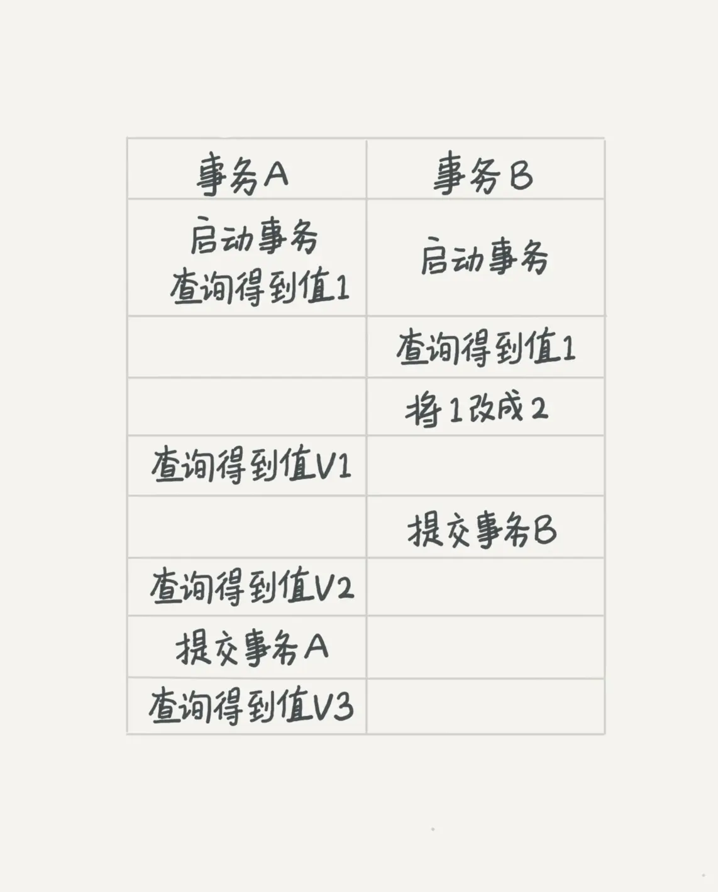
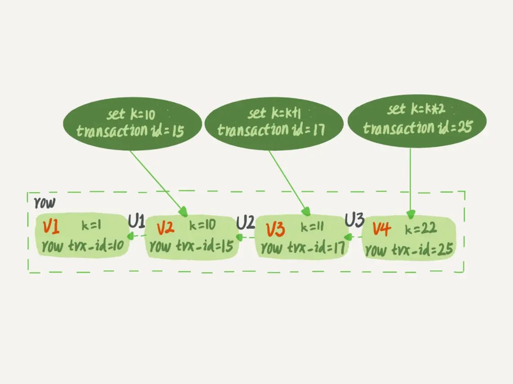
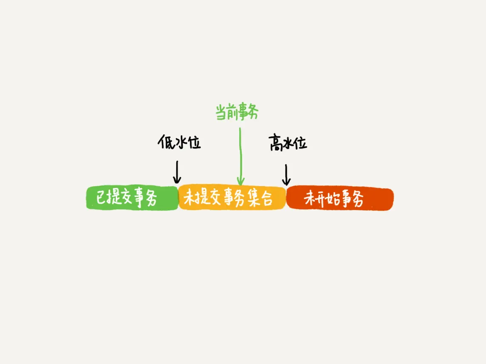

## Mysql Transaction
1. Mysql 事务在引擎层实现，MyISAM 引擎不支持事务
2. 
3. 长事务意味着系统里面会存在很老的事务视图。由于这些事务随时可能访问数据库里面的任何数据，所以这个事务提交之前，数据库里面它可能用到的回滚记录都必须保留，这就会导致大量占用存储空间。

### Mysql 事务隔离级别
   SQL 标准的事务隔离级别包括：读未提交（read uncommitted）、读提交（read committed）、可重复读（repeatable read）和串行化（serializable ）
1. 读未提交是指，一个事务还没提交时，它做的变更就能被别的事务看到。
2. 读提交是指，一个事务提交之后，它做的变更才会被其他事务看到。
3. 可重复读是指，一个事务执行过程中看到的数据，总是跟这个事务在启动时看到的数据是一致的。当然在可重复读隔离级别下，未提交变更对其他事务也是不可见的。
    - 一个事务启动的时候，能够看到所有已经提交的事务结果。但是之后，这个事务执行期间，其他事务的更新对它不可见。
    - 如果是可重复读隔离级别，事务 T 启动的时候会创建一个视图 read-view，之后事务 T 执行期间，即使有其他事务修改了数据，事务 T 看到的仍然跟在启动时看到的一样。
4. 串行化，顾名思义是对于同一行记录，“写”会加“写锁”，“读”会加“读锁”。当出现读写锁冲突的时候，后访问的事务必须等前一个事务执行完成，才能继续执行。
- 示例说明: 

    - 若隔离级别是“读未提交”， 则 V1 的值就是 2。这时候事务 B 虽然还没有提交，但是结果已经被 A 看到了。因此，V2、V3 也都是 2。
    - 若隔离级别是“读提交”，则 V1 是 1，V2 的值是 2。事务 B 的更新在提交后才能被 A 看到。所以， V3 的值也是 2。
    - 若隔离级别是“可重复读”，则 V1、V2 是 1，V3 是 2。之所以 V2 还是 1，遵循的就是这个要求：事务在执行期间看到的数据前后必须是一致的。
    - 若隔离级别是“串行化”，则在事务 B 执行“将 1 改成 2”的时候，会被锁住。直到事务 A 提交后，事务 B 才可以继续执行。所以从 A 的角度看， V1、V2 值是 1，V3 的值是 2。
     为保证数据库隔离级别的一致，建议将MySQL 的隔离级别设置为“读提交”

- 查看、设置事务隔离级别
   ```sql
    /* 查看事务隔离级别 */
    show variables like 'transaction_isolation';
    SELECT @@tx_isolation;  
    /* 设置事务隔离级别 */
    /* 设置read uncommitted级别：读未提交*/
    set session transaction isolation level read uncommitted;
   
   /*设置read committed级别：读提交*/
   set session transaction isolation level read committed;
   
   /*设置repeatable read级别：可重复读*/
   set session transaction isolation level repeatable read;
   
   /*设置serializable级别：串行化*/
   set session transaction isolation level serializable;
   ```
### 事务的开启方式
1. 显式启动事务语句，
   1. 立即启动一个事务，(一致性视图是在执行 start transaction with consistent snapshot 时创建的)
    ```sql
    start transaction with consistent snapshot;
    ```
   2. 普通的启动一个事务,(一致性视图是在执行第一个快照读语句时创建的)
   ```sql
    begin; 
    /** 或者 **/
    start transaction;
    ```
   - 注意: begin/start transaction 命令并不是一个事务的起点，在执行到它们之后的第一个操作 InnoDB 表的语句，事务才真正启动;
2. set autocommit=0，这个命令会将这个线程的自动提交关掉。意味着如果你只执行一个 select 语句，这个事务就启动了，而且并不会自动提交。这个事务持续存在直到你主动执行 commit 或 rollback 语句，或者断开连接

### 查询长事务
1. 查找持续时间超过 60s 的事务
```sql
select * from information_schema.innodb_trx where TIME_TO_SEC(timediff(now(),trx_started))>60
```
2. 如何避免长事务对业务的影响？
    - 应用端
        1. 确认是否使用了 set autocommit=0。这个确认工作可以在测试环境中开展，把 MySQL 的 general_log 开起来，然后随便跑一个业务逻辑，通过 general_log 的日志来确认。一般框架如果会设置这个值，也就会提供参数来控制行为，你的目标就是把它改成 1。
        2. 确认是否有不必要的只读事务。有些框架会习惯不管什么语句先用 begin/commit 框起来。我见过有些是业务并没有这个需要，但是也把好几个 select 语句放到了事务中。这种只读事务可以去掉。
        3. 业务连接数据库的时候，根据业务本身的预估，通过 SET MAX_EXECUTION_TIME 命令，来控制每个语句执行的最长时间，避免单个语句意外执行太长时间。（为什么会意外？在后续的文章中会提到这类案例）
    - 数据库服务端
        1. 监控 information_schema.Innodb_trx 表，设置长事务阈值，超过就报警 / 或者 kill；
        2. Percona 的 pt-kill 这个工具不错，推荐使用；
        3. 在业务功能测试阶段要求输出所有的 general_log，分析日志行为提前发现问题；
        4. 如果使用的是 MySQL 5.6 或者更新版本，把 innodb_undo_tablespaces 设置成 2（或更大的值）。如果真的出现大事务导致回滚段过大，这样设置后清理起来更方便。
    
### 事务过程
InnoDB 里面每个事务有一个唯一的事务 ID，叫作 transaction id。它是在事务开始的时候向 InnoDB 的事务系统申请的，是按申请顺序严格递增的。而每行数据也都是有多个版本的。每次事务更新数据的时候，都会生成一个新的数据版本，并且把 transaction id 赋值给这个数据版本的事务 ID，记为 row trx_id。同时，旧的数据版本要保留，并且在新的数据版本中，能够有信息可以直接拿到它。也就是说，数据表中的一行记录，其实可能有多个版本 (row)，每个版本有自己的 row trx_id。

1. 当前最新版本是 V4，k 的值是 22，它是被 transaction id 为 25 的事务更新的，因此它的 row trx_id 也是 25
2. 三个虚线箭头，就是 undo log;而 V1、V2、V3 并不是物理上真实存在的，而是每次需要的时候根据当前版本和 undo log 计算出来的。

#### InnoDB 事务实现
InnoDB 为每个事务构造了一个数组，用来保存这个事务启动瞬间，当前正在“活跃”的所有事务 ID。“活跃”指的就是，启动了但还没提交。数组里面事务 ID 的最小值记为低水位，当前系统里面已经创建过的事务 ID 的最大值加 1 记为高水位。这个视图数组和高水位，就组成了当前事务的一致性视图（read-view）。而数据版本的可见性规则，就是基于数据的 row trx_id 和这个一致性视图的对比结果得到的。

当前事务的启动瞬间来说，一个数据版本的 row trx_id，有以下几种可能
0. 注意: 现在正在执行的所有事物ID列表”，如果一个row trx_id在这列表中，也要不可见。
1. 如果落在绿色部分，表示这个版本是已提交的事务或者是当前事务自己生成的，这个数据是可见的；
2. 如果落在红色部分，表示这个版本是由将来启动的事务生成的，是肯定不可见的；
3. 如果落在黄色部分，那就包括两种情况
    1. 若 row trx_id 在数组中，表示这个版本是由还没提交的事务生成的，不可见；
    2. 若 row trx_id 不在数组中，表示这个版本是已经提交了的事务生成的，可见。

   - 假设性案例:
     1. 事务 A 开始前，系统里面只有一个活跃事务 ID 是 99；
     2. 事务 A、B、C 的版本号分别是 100、101、102，且当前系统里只有这四个事务；
     3. 三个事务开始前，(1,1）这一行数据的 row trx_id 是 90。
     4. 推论得出: 事务 A 的视图数组就是[99,100], 事务 B 的视图数组是[99,100,101], 事务 C 的视图数组是[99,100,101,102]
   
     - 第一个有效更新是事务 C，把数据从 (1,1) 改成了 (1,2)。这时候，这个数据的最新版本的 row trx_id 是 102，而 90 这个版本已经成为了历史版本。
     - 第二个有效更新是事务 B，把数据从 (1,2) 改成了 (1,3)。这时候，这个数据的最新版本（即 row trx_id）是 101，而 102 又成为了历史版本。
     - 在事务 A 查询的流程
       - 找到 (1,3) 的时候，判断出 row trx_id=101，比高水位大，处于红色区域，不可见；
       - 接着，找到上一个历史版本，一看 row trx_id=102，比高水位大，处于红色区域，不可见；
       - 再往前找，终于找到了（1,1)，它的 row trx_id=90，比低水位小，处于绿色区域，可见。 
     1. 疑问: 事务 B 的视图数组是先生成的，之后事务 C 才提交，不是应该看不见 (1,2) 吗，怎么能算出 (1,3) 来？
       - 如果事务 B 在更新之前查询一次数据，这个查询返回的 k 的值确实是 1
       - 当它要去更新数据的时候，就不能再在历史版本上更新了，否则事务 C 的更新就丢失了。因此，事务 B 此时的 set k=k+1 是在（1,2）的基础上进行的操作。
     2. 结论: 更新数据都是先读后写的，而这个读，只能读当前的值，称为“当前读”（current read）
     3. 扩展: 除了 update 语句外，select 语句如果加锁，也是当前读。
       ```sql
       select k from tbl_user where id=1 lock in share mode;
       /* 或 */
       select k from tbl_user where id=1 for update;
       ```
   - 案例扩展(当事务 C 不是马上提交的，事务B如何处理？)
     
     事务 C更新后并没有马上提交，也就是说 (1,2) 这个版本上的写锁还没释放。而事务 B 是当前读，必须要读最新版本，而且必须加锁，因此就被锁住了，必须等到事务 C’释放这个锁，才能继续它的当前读。