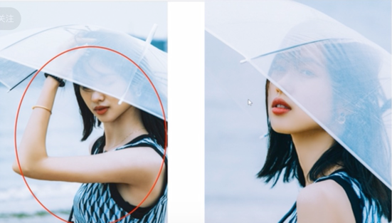
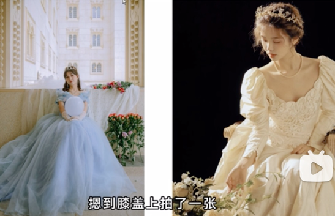
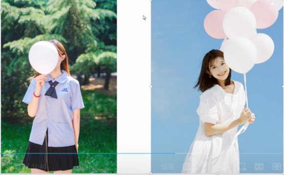
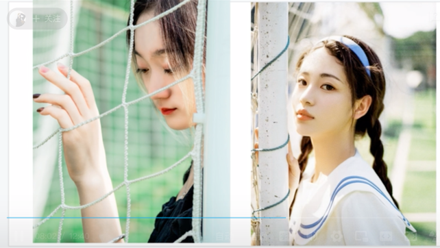
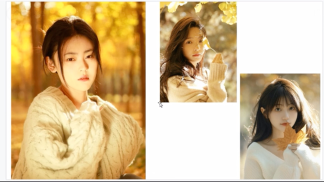

# Photography Pose (摆拍姿势)
## 摆姿的意义

摆姿是让模特凹突更好的身材曲线，或者让画面更灵动，如果你的摆姿不能展现身材、而且动作僵硬、呆板则不如不摆。

## 做减法

有些人拍人像的时候喜欢做些花里胡哨的动作，不明所以的摆姿会让人看起来特别“无厘头”，为了摆姿而摆姿，大家要明确一点，就是人像摄影。
摆姿只是辅助。主要表现的是人物情绪，这才是重中之重。根据照片传递的内容，根据模特表达的情绪，合理的安排相应的美姿就行，不用太复杂，简简单单的才是真!

## 学会用道具

## 美姿
### 了解摆拍姿势的基本原理

### 多练，对着镜子练

### 多拍多实操

### 多利用道具和场景元素

### 不要过于复杂弄巧成拙

### 破面
把任务腿部、上半身、脸各分成一个面，不能让这三部分直直的对着镜头。

### 错误案例
1. 摆拍姿势过于突出（摆拍姿势只是陪衬）

2. 摆拍姿势过于随意（坐姿与公主衣服、场景不搭）

 
3. 不知所以（摆拍姿势-图片不知其表达）

4. 画蛇添足（摆拍姿势-摆拍姿势只是陪衬）

5. 画蛇添足（摆拍姿势-摆拍姿势只是陪衬）

6. 画蛇添足（摆拍姿势-摆拍姿势只是陪衬）

