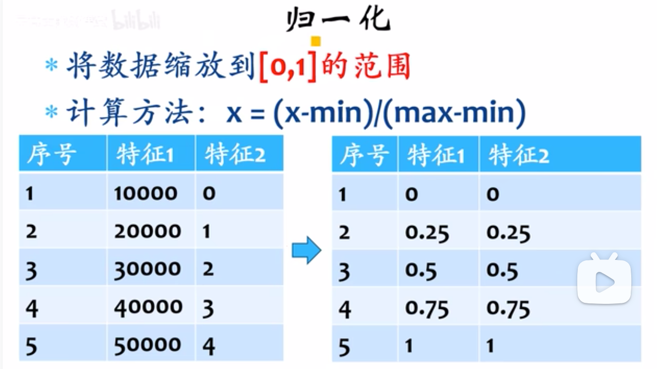
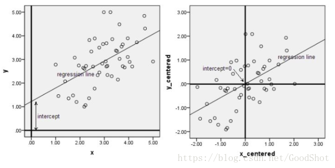

# 数据预处理
1. 标准化、归一化标签:
    1. 为什么需要标准化、归一化处理？
        - 数据范围差异巨大、导致训练不收敛或其它问题
        - 所有数据在取值空间范围更容易处理，方便模型的统一化和规范化
        - 更容易发现数据的本质规律

### 归一化
1. 什么是归一化: 
    1. 归一化是利用特征的最大值，最小值，将特征的值缩放到[0,1]区间，对于每一列的特征使用min - max函数进行缩放。
    2. 归一化可以消除纲量，加快收敛。不同特征往往具有不同的量纲单位，这样的情况会影响到数据分析的结果，为了消除指标之间的量纲影响，需要进行数据归一化处理，以解决数据指标之间的可比性。原始数据经过数据归一化处理后，各指标处于[0,1]之间的小数，适合进行综合对比评价。
    3. 归一化可能模型提高精度。
2. 归一化方法
    1. min-max标准化方法
        - 把数据 缩放到 [0~1]的范围
        - 缺点: 当有新数据加入时，可能导致max和min的变化，需要重新定义
        - 公式: x' = (x-min)/(max-min)
          
        - python实现
          ```python
          from sklearn import preprocessing
          import numpy as np
        
          # 创建一组特征数据，每一行标识一个样本，每一列标识一个特征
          X_train = np.array([[ 1, -1,  2],
                              [ 2,  0,  0],
                              [ 0,  1, -1]])
          min_max_scaler = preprocessing.MinMaxScaler()
      
          # 填充、转化数据
          X_train_minmax = min_max_scaler.fit_transform(X_train)
          print(X_train_minmax)
      
          # 将相同的缩放应用到测试集数据中
          X_test = np.array([[ -3, -1,  4]])
          X_test_minmax = min_max_scaler.transform(X_test)
          print(X_test_minmax)
      
          # 打印缩放因子等属性
          print(min_max_scaler.scale_)
          print(min_max_scaler.min_)
          ```
    2. log函数转换(对数函数转换)
        1. 说明
            - 非线性归一化
            - 方程: y = log10(x)
    3. atan函数转换(反余切函数转换)
        1. 说明
            - 非线性归一化
            - 方程: y = atan(x) * 2 / π
    4. l2-norm归一化
        1. 说明: 
            - 正则化是将样本在向量空间模型上的一个转换，经常被使用在分类与聚类中。
        2. 特性
            - normalize和Normalizer都既可以用在密集数组也可以用在稀疏矩阵（scipy.sparse)中
            - 对于稀疏的输入数据，它会被转变成维亚索的稀疏行表征（具体请见scipy.sparse.csr_matrix)
        3. python实现
            ```python
            from sklearn import preprocessing
            import numpy as np
            X_train = np.array([[ 1., -1.,  2.],
                                [ 2.,  0.,  0.],
                                [ 0.,  1., -1.]])
            normalizer = preprocessing.Normalizer()
          
            # 填充数据
            normalizer.fit(X_train)
          
            # 转化数据
            normalizer.transform(x)
          
            # 新数据
            X_test = np.array([[ -1, 1,  0]])
          
            # 转化新数据
            X_test_normalizer = normalizer.transform(X_test)
            print(X_test_normalizer)
            ```
### 标准化
1. 什么是标准化
    1. 标准化是通过特征的平均值和标准差，将特征缩放成一个标准的正态分布，缩放后均值为0，方差为1。但即使数据不服从正态分布，也可以用此法。特别适用于数据的最大值和最小值未知，或存在孤立点。
    2. 标准化是为了方便数据的下一步处理，而进行的数据缩放等变换，不同于归一化，并不是为了方便与其他数据一同处理或比较。
2. 标准化方法
    1. Z-score标准化方法
        - 将数据转换到 0 值附近
        - 公式: x' = (x - 每列均值)/标准差
          
        - python实现方式
            ```python
            from sklearn import preprocessing
            import numpy as np
            X_train = np.array([[ 1., -1.,  2.],
                                [ 2.,  0.,  0.],
                                [ 0.,  1., -1.]])
          
            # 调用fit方法，根据已有的训练数据创建一个标准化的转换器,并填充数据
            scaler = preprocessing.StandardScaler().fit(X)
            print(scaler)
            print(scaler.mean_)
          
            # 使用上面这个转换器去转换训练数据x,调用transform方法
            print(scaler.transform(X))
          
            # 可以直接使用训练集对测试集数据进行转换
            print(scaler.transform([[-1., 1., 0.]]))
            ```
### 中心化
 - 

### One-Hot编码
1. 使用场景:
    1. 求相似度，用 独热编码 相减，即可获取相似度、最近距离
2. 局限性: 数据量大时
    1. 自然语言中，对单词进行编码，单词量大，向量值大。
    2. 推荐系统中，物品Id做编码，物品量上万，向量值大
3. 案例说明
    1. One-hot 编码 (独热编码): 一位有效编码
        - 说明: ( 4行3列: 4个样本、3个特征) 有4 个学生，第1~4列数据分别表述为性别(0 女 1 男)、年纪(小学、初中、高中)、爱好(钢琴、绘画、舞蹈、篮球)
            - 学生1: 女、小学、舞蹈
            - 学生2: 男、高中、篮球
            - 学生3: 男、初中、钢琴
            - 学生4: 女、小学、绘画
            - 训练数据: 男、小学、舞蹈
    2. Python 中调用:
        ```python
        # sklearn 中的 OneHotEncoder
        from sklearn.preprocessing import OneHotEncoder
        # 模拟的训练数据
        X = [[0, 0, 2], [1, 2, 3], [1, 1, 0], [0, 0, 1] ]
        # sparse 是否采用紧缩格式/稀疏矩阵
        enc = OneHotEncoder(sparse= False)
        # 填充数据
        enc.fit(X)
        # 测试数据
        x_test = [[1, 0, 2]]
        result = enc.transform(x_test)
        print(result)
        # 输出结果为 [[0,1,1,0,0,0,0,1,0]]
        ```
        - 解读:
            1. 特征1: 性别，存在数据 0、1，即离散编码为: 0 -> 10, 1 -> 01
            2. 特征2: 年纪，存在数据 0、2、1，即离散编码为: 0 -> 100、1 -> 010、2-> 001
            3. 特征3: 爱好，存在数据 2、3、0、1，即离散编码为: 0 -> 1000、1 -> 0100、2 -> 0010、3 -> 0001


### 致谢
- 参考: https://ssjcoding.github.io/2019/03/27/normalization-and-standardization