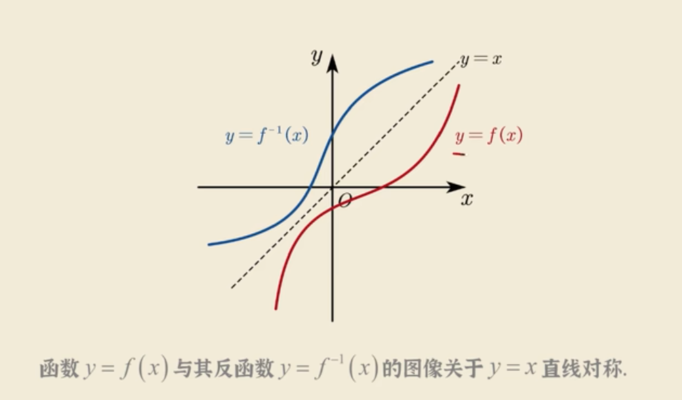
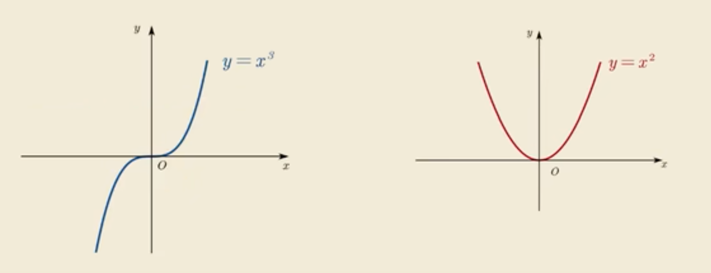

# 函数 Function
## 反函数

1. 设 $y=f(x)$的定义域为D,值为$R_f$，若对于任意 $y \in R_f$，都可确定唯一的$x \in D$，满足$y=f(x)$，则称x为y的函数，记为$x=f^{-1}(y)$，称为$y=f(x)$的反函数

2. 反函数案例
    1. 案例1
    
       1. $y=x^3$ 与 $y=\sqrt[3]{x}$互为反函数
       2. ${y=x^2}$ 因在x区间内存在两个相交点，故在 $[-\infty,+\infty]$区间内无反函数