# 三角形
1. 分类
    1. 按角分
        1. 锐角三角形: 三角形的三个内角都小于90度
        2. 直角三角形: 三角形的三个内角中一个角等于90度，可记作Rt△。
        3. 钝角三角形: 三角形的三个内角中有一个角大于90度且小于180度。
    2. 按边分
        1. 等腰三角形：定义: 有两条边相等的三角形
        2. 等边三角形(正三角形): 三边相等的三角形
## 定理
### 基础定理
1. 内角和定理‌
    1. 任意三角形三个内角的和等于‌180°‌
2. 三边关系定理‌
    1. 三角形任意两边之和大于第三边，任意两边之差小于第三边。
### 函数定理
1. 勾股定理
   1. 公式: $ {a^2+b^2=c^2} $
2. 基础三角函数(锐角三角函数)
   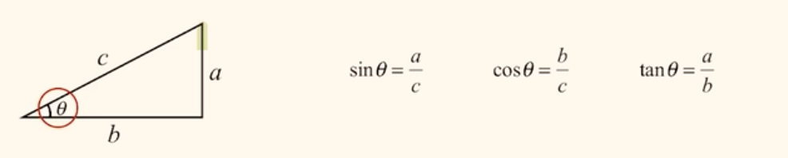
   1. 公式
       1. 正弦: $\sin\alpha=\dfrac{对边}{斜边}=\dfrac{a}{c} $
           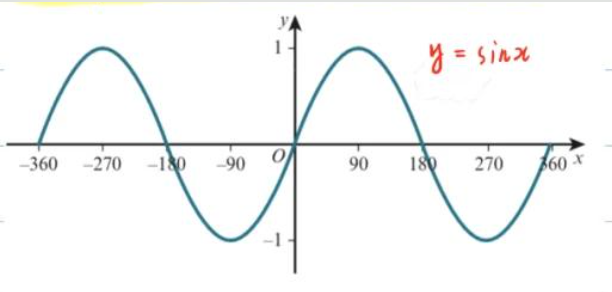
           - 
           - 奇偶性: 奇函数
           - 周期性: $T = \pi$
       2. 余弦: $\cos\alpha=\dfrac{邻边}{斜边}=\dfrac{b}{c} $
          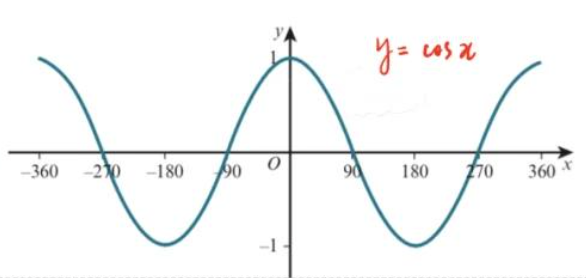
       3. 正切: $\tan\alpha=\dfrac{对边}{邻边}=\dfrac{a}{b} $
          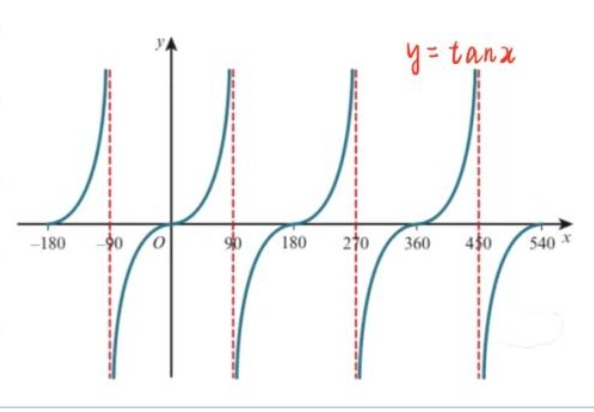
       4. 余切: $\cot\alpha=\dfrac{邻边}{对边}=\dfrac{b}{a} $
          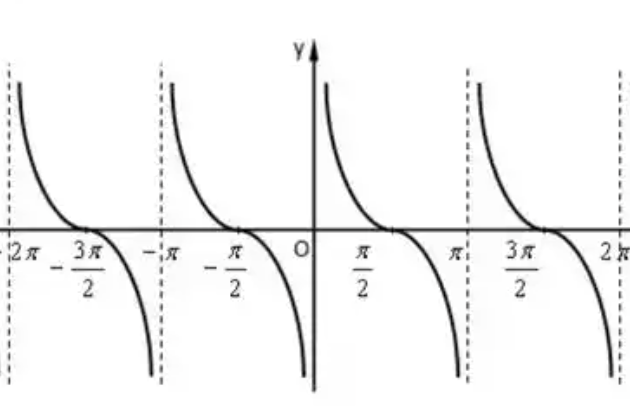
       5. 正割: $\sec\alpha=\dfrac{斜边}{邻边}=\dfrac{c}{b}$
          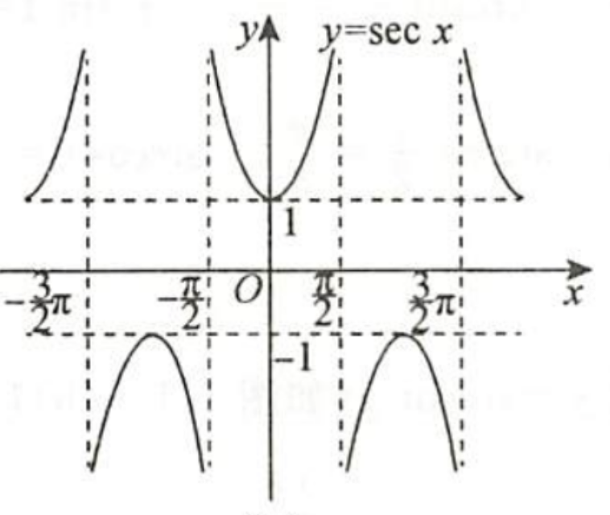
       6. 余割: $\csc\alpha=\dfrac{斜边}{对边}=\dfrac{c}{a} $
          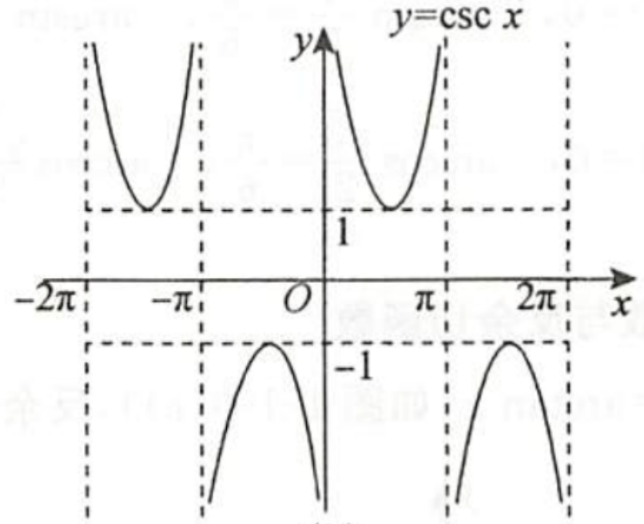
   2. 关系
       1. $ \sin\alpha = \dfrac{\cos\alpha}{\cot\alpha} $
       2. $ \tan\alpha = \dfrac{\sin\alpha}{\cos\alpha} $
       3. $ \cot\alpha = \dfrac{\cos\alpha}{\sin\alpha} = \dfrac{1}{\tan\alpha} $
       4. $ \sec\alpha = \dfrac{1}{\cos\alpha} $
       5. $ \csc\alpha = \dfrac{1}{\sin\alpha} $
       6. 正弦 ↔ 余割：$\sin\alpha\cdot\csc\alpha=1$
       7. 余弦 ↔ 正割：$\cos\alpha\cdot\sec\alpha=1$
       8. 正切 ↔ 余切：$\tan\alpha\cdot\cot\alpha=1$
3. 任意角三角函数
   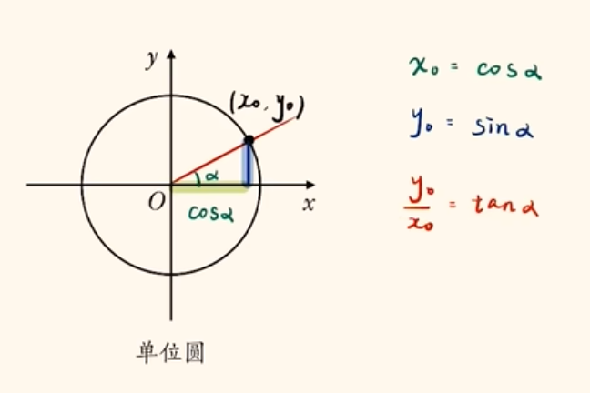
   1. 注
       1. 原点O，半径r = 1的圆，叫单位圆
       2. 两点距离公式: $\sqrt{x^2+y^2}=1 $
   2. 技巧: 
       1. 将$\pi$看做为 $180^\circ$
   3. 参考
      1. [高中参考](https://www.bilibili.com/video/BV1EZ2QBtERw)
4. 反三角函数
   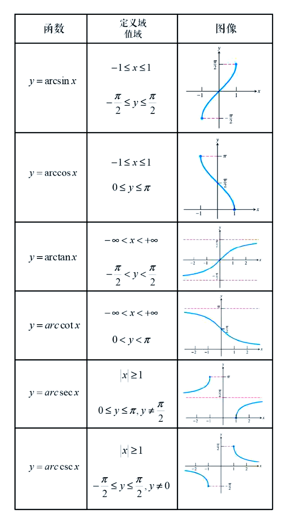
   1. $arcsin\alpha$
      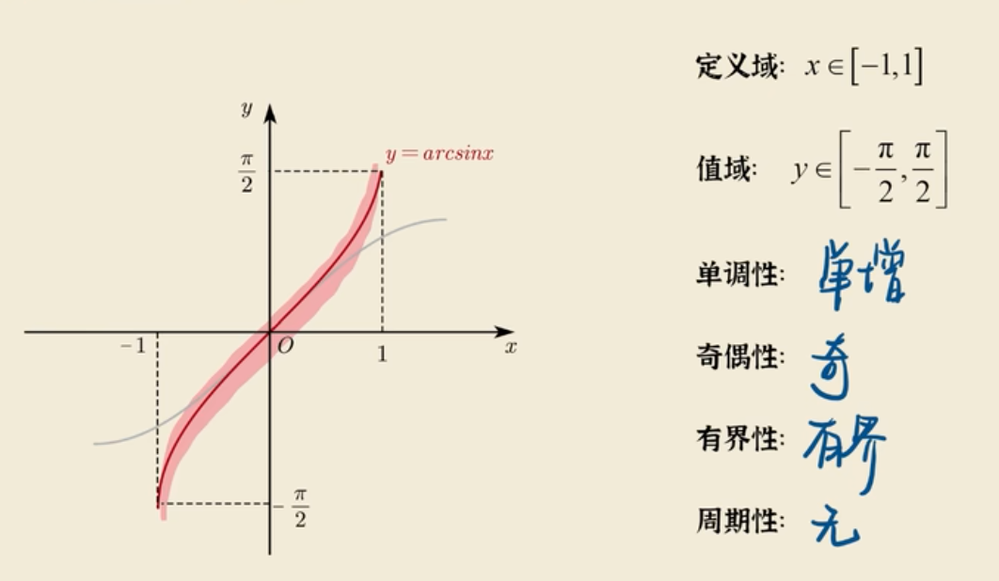
      1. $ \arcsin\alpha = sin\alpha $ 的反函数
      2. 定义域: $ x \in [-1,1] $，
      3. 值域: $ y \in [-\dfrac{\pi}{2},\dfrac{\pi}{2}]$
   2. $\arccos\alpha$
      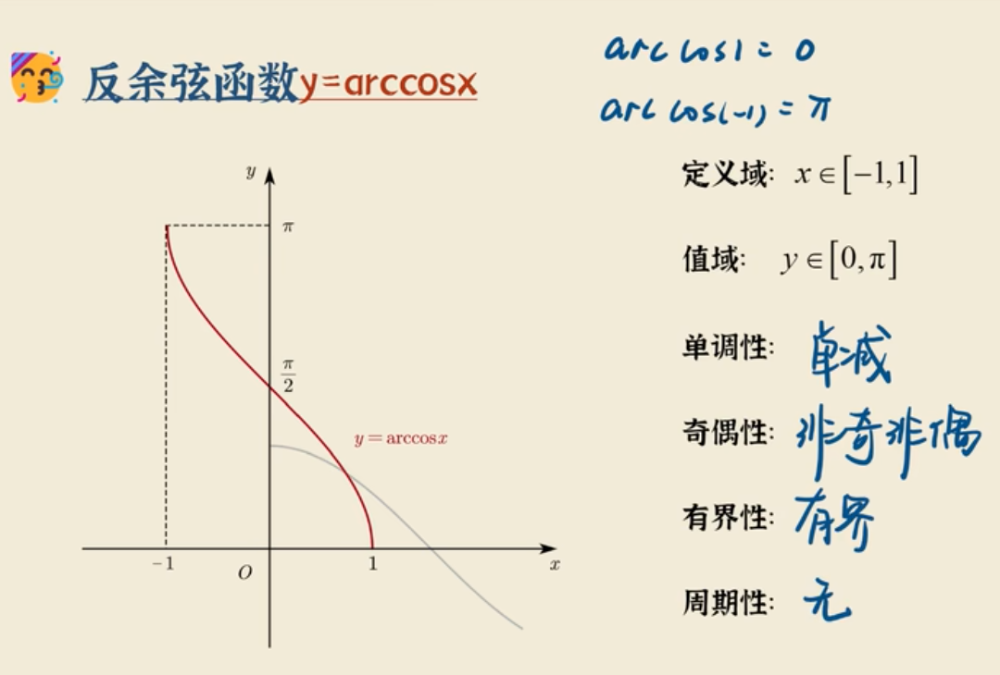
      1. $ \arccos\alpha = cos\alpha $ 的反函数
      2. 定义域: $ x \in [-1,1] $，
      3. 值域: $ y \in [0,{\pi}]$
