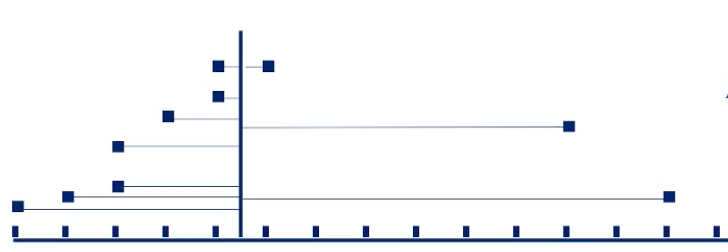
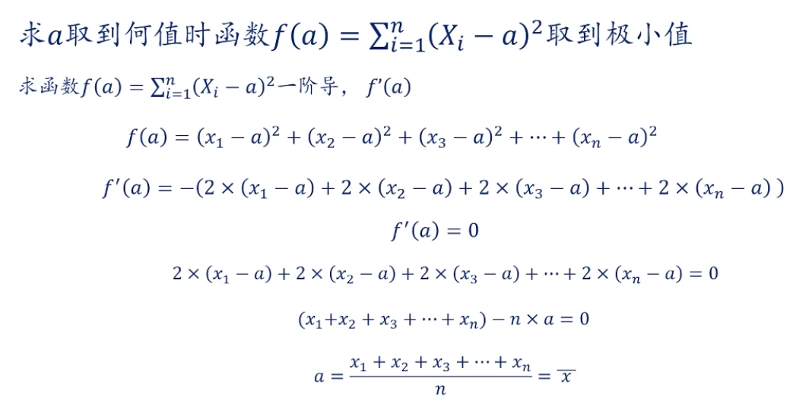

# 描述统计学 (Descriptive Statistics)
## 极差
1. 公式：$ R = X_{max}-X_{min} $
2. 理解：在一组数据中，最大的数据与最小数据的差值
3. 极差较大，数据波动较大，稳定性差

## 中位数
1. 概念: 将一组数据按照从小到大的顺序排列(或者从大到小的顺序也可以)之后处在数列中点位置的数值,是典型的位置平均数,不受极端变量值的影响
2. 公式
    1. 奇数公式: $$ m_{0.5} = X_{\left( \frac{N+1}{2} \right)} $$
    2. 偶数公式: $$ m_{0.5} = \frac{X_{\left( \frac{N}{2} \right)} + X_{\left( \frac{N}{2}+1 \right)}}{2} $$  

## 平均数
1. 公式: $$ A_n = \frac{a_1 + a_2 + a_3 + \dots + a_n}{n} $$
2. 理解: 在一组是数据中，所有数据的和，除以数据的个数

## 方差
1. 总体方差
    1. 公式: $$ \sigma^2=\frac{1}{N}\sum_{i=1}^N (x_i-\mu)^2 $$
    2. 注: $ \sum_{i=1}^N $ 为累加符, $ \mu $为总体均值(即一组全部数据中的平均数)
    3. 公式理解: 
    
        
        - 点 为数据值的坐标
        - 竖线为这组数据的平均值，
        - 横线为数据值到平均值的距离
        - 方差就是这组数据到平均值距离和的平方
2. 样本方差
    1. 公式: $$ S^2=\frac{1}{N-1}\sum_{i=1}^N (x_i-\bar{x})^2 $$
    2. 样本为总体的一个真子集，
    3. 在总体均值已知时，需采用公式，总体方差 (即: $ \sigma^2=\frac{1}{N}\sum_{i=1}^N (x_i-\mu)^2 $)
    4. 在样本量较大，无法获取全部数据，即无法获取总体均值时，$ \bar{x} $ 为样本的均值，采用样本方差公式（即 $ S^2=\frac{1}{N-1}\sum_{i=1}^N (x_i-\bar{x})^2 $）
    5. 因为 $\mu$为总体平均值，故存在$ \sum_{i=1}^N (x_i-\mu)^2 > \sum_{i=1}^N (x_i-\bar{x})^2 $
        
        
        - 求导规则：$ \dfrac{d}{da}(u-a)^2 = 2(u-a)\cdot(-1) = -2(u-a) $
        - 来源自: [Bilibili](https://www.bilibili.com/video/BV1Dq4y1c7zn)
3. 方差表示一组数据的离散情况，数据越稳定，值越小，方差越大，数据波动较大
## 标准差
1. 总体标准差
    1. 公式: $$ \sigma=\sqrt{\frac{1}{N}\sum_{i=1}^N (x_i-\bar{x})^2} $$
2. 样本标准差
    1. 公式: $$ S=\sqrt{\frac{1}{N-1}\sum_{i=1}^N (x_i-\bar{x})^2} $$ 
3. 对方差开根号得标准差
## 众数
1. 概念：一组数据中出现频次最高的数值，可存在一个或多个众数，适合分类数据、离散数据
2. 特点：不受极值影响，体现数据集中高频数值

## 举例说明
1. 存在两组数据
    ```
    甲组: 15、8、12、21、15、19、15
    乙组: 13、14、9、18、20、18、16、22
    ```
    1. 极差:
        - 甲组: 21 - 8 = 13
        - 乙组: 22 - 9 = 13
    2. 中位数:
        - 甲组(7位): 第$\frac{7+1}{2}=4$ 位数值: 15
        - 乙组(8位): 第$\frac{4位+5位}{2} = \frac{16+18}{2} = 17$
    3. 算数平均数
        - 甲组: $\frac{15+8+12+21+15+19+15}{7} = \frac{105}{7} = 15$
        - 乙组: $\frac{13+14+9+18+20+18+16+22}{8} = \frac{130}{8} = 16.5$
    4. 方差
        - 甲组: $\frac{(15-15)+(8-15)+(12-15)+(21-15)+(15-15)+(19-15)+(15-15)}{7}=\frac{110}{7}$
        - 乙组: $\frac{(13-16.5)+(14-16.5)+(9-16.5)+(18-16.5)+(20-16.5)+(18-16.5)+(16-16.5)+(22-16.5)}{8}=\frac{130}{8}$
    4. 标准差
       - 甲组: $\sqrt{\frac{(15-15)+(8-15)+(12-15)+(21-15)+(15-15)+(19-15)+(15-15)}{7}}=\sqrt{\frac{110}{7}}$
       - 乙组: $\sqrt{\frac{(13-16.5)+(14-16.5)+(9-16.5)+(18-16.5)+(20-16.5)+(18-16.5)+(16-16.5)+(22-16.5)}{8}}=\sqrt{\frac{130}{8}}$