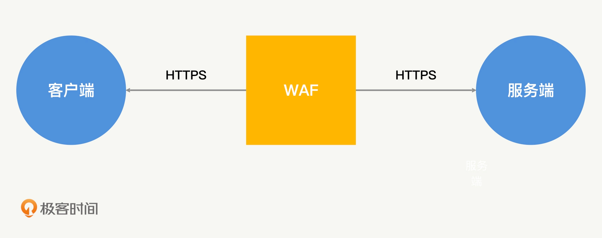
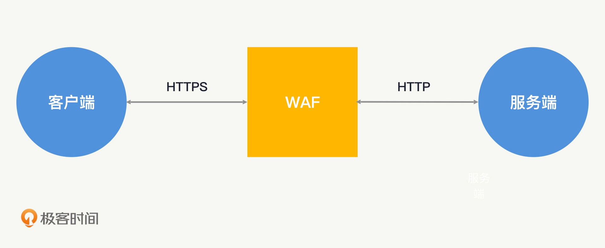

## Web Application Firewall(Web应用防火墙)
### 透明代理
透明代理和大部分防火墙的工作模式相同,在客户端和服务端通信不需要作出任何改变的情况下，对 HTTP 流量进行请求和转发。

### 反向代理
反向代理要求客户端将请求的目标地址指向 WAF，而不是服务端。相当于是Nginx，很多开源WAF框架也基于Nginx基础进行Lua脚本开发

#### 插件模式

