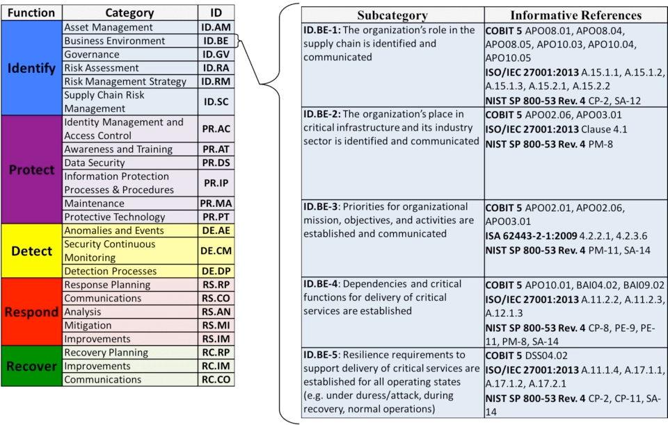

# 国内: 等级保护制度
## 1级等保

## 5级等保

# 国外: 安全标准
## ISO27000 系列
### 安全方向
1. 安全策略
2. 信息安全组织
3. 人力资源安全
4. 资产管理
5. 访问控制
6. 密码学
7. 物理和环境安全
8. 操作安全
9. 通信安全
10. 系统获取、开发和维护
11. 供应关系
12. 信息安全事件管理
13. 业务连续性管理中的信息安全考虑
14. 符合性
### PDCA流程
- Plan：计划，确定安全的目标并制定建设的规划。
- Do：执行，按照计划的内容和时间来执行。
- Check：检查，对执行的结果进行总结，看是否符合预期。
- Action：改进，如果执行不符合预期，或者计划出现纰漏，则进行分析和改进。
## NIST
### IPDRR
NIST 提出了公司建立安全体系的 IPDRR 方法框架，主要包括 Identiify、Protect、Detect、Respond 和 Recover 这五个部分。
 
1. Identify（识别）
2. Protect（保护）
3. Detect（检测）
4. Respond（响应）
5. Recover（恢复）
# COBIT（ Control Objectives for Information and related Technology）

# ITIL（ Information Technology Infrastructure Library ）