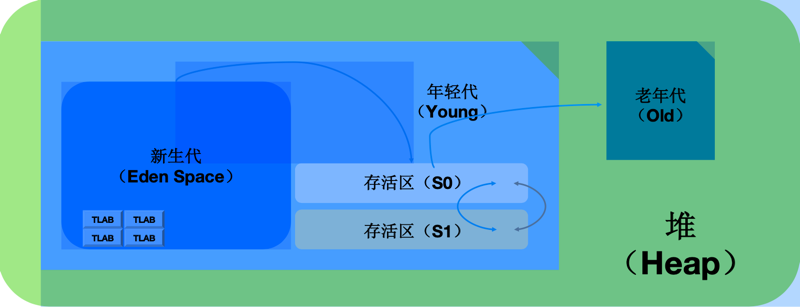

# GC
1. 堆内存GC
   - JVM(采用分代回收的策略)，用较高的频率对年轻的对象(young generation)进行YGC，而对老对象(tenured generation)较少(tenured generation 满了后才进行)进行Full GC。这样就不需要每次GC都将内存中所有对象都检查一遍。
2. 非堆内存GC
   - GC不会在主程序运行期对PermGen Space进行清理，所以如果你的应用中有很多CLASS
     (特别是动态生成类，当然permgen space存放的内容不仅限于类)的话,就很可能出现PermGen Space错误

## 分治/分代收集(generational collection): 
1. 分代: 将不同生命周期的对象放在不同区域
2. 请求分代处理: 将请求中创建的对象按生命周期治理收集管理。
### 分代收集过程 (堆):
1. young generation(生命周期短)(绝大部分object分配位置)
    - 满  -> 引发minor collection(YGC) -> 在minor collection后存活的object会被移动到tenured generation
2. tenured generation(生命周期比较长)
    - 满  -> 触发major collection,major collection（Full gc）会触发整个heap的回收
3. permanet generation (持久代GC)
    - 满 -> 未配置为采用CMS GC情况下，触发 Full GC, Full GC 仍然处理不了，抛出异常: java.lang.OutOfMemoryError: PermGen space
- 注意: 我们应尽量减少 Full gc 的次数(tenured generation 一般比较大,收集的时间较长,频繁的Full gc会导致应用的性能收到严重的影响)
### GC 组成
#### YongGC

1. Eden Space (新生代)
   1. TLAB: (Thread Local Allocation Buffer，线程本地分配缓冲区) ,Java 堆中划分出来的针对每个线程的内存区域，专门在该区域为该线程创建的对象分配内存。它的主要目的是在多线程并发环境下需要进行内存分配的时候，减少线程之间对于内存分配区域的竞争，加速内存分配的速度。
2. Survivor (存活区)
   1. 其中一个survivor区域一直是空的，是eden区域和另一个survivor区域在下一次copy collection后活着的object的目的地。
   2. object在survivor区域被复制直到转移到tenured区。

### 垃圾收集器
| JDK版本         | 收集器                          | 说明                                                             | 启动参数                                                                             | 参数说明                  | 默认值 | 运行  | 区域    | 算法         |场景|
|---------------|------------------------------|----------------------------------------------------------------|----------------------------------------------------------------------------------|-----------------------|-----|-----|-------|------------|---|
|               | Serial                       | 单线程收集器                                                         | -XX:+UseSerialGC                                                                 | 最基本垃圾收集器 (Serial: 连续) |     | 串行  | 新生代   | 复制算法       | |
|               | Serial Old                   | 单线程收集器                                                         |                                                                                  |                       |     | 串行  | 老年代   | 标记-整理      | |
|               | ParNew                       | ParNew收集器是Serial收集器的多线程版本                                      | -XX:+UseParNewGC                                                                 | 设置年轻代为并行收集(多线程收集)     |     | 并行  | 新生代   | 复制算法       |
 | JDK1.7、JDK1.8 | Parallel Scavenge            |                                                                | -XX:+UseParallelGC                                             | 设置为并行收集(仅对年轻代有效)      |     | 并行  | 新生代   | 复制算法       | |
| JDK1.7、JDK1.8 | Parallel Old                 |                                                                | -XX:+UseParallelOldGC                                          | 设置为并行收集(仅对老年代有效)      |     | 并行  | 老年代   | 标记-整理      | |
|               | CMS (Concurrent Mark Sweep)  | 收集器区别于Parallel Scavenge和Parallel Old收集器,它是一种以获取最短回收停顿时间为目标的收集器 | -XX:+UseCMSInitiatingOccupancyOnly </br> -XX:CMSInitiatingOccupancyFraction=70 | 使用CMS垃圾收集器            |     | 并发  | 老年代   | 标记-清除      |   |
| JDK1.9、JDK17  | G1                           |                                                                | -XX:+UseG1GC                                                   | 使用G1垃圾收集器             |     | 并发  | Both  | 标记-整理 + 复制 | |

#### 垃圾收集器的并发与并行
1. 并行 (Parallel): 指多条垃圾收集线程并行工作，但此时用户线程仍然处于等待状态。
   
2. 并发 (Concurrent):指用户线程与垃圾收集线程同时执行（但不一定是并行的，可能会交替执行），用户程序在继续运行，而垃圾收集程序运行于另一个CPU上。
   

### 内存回收算法


### 查看Java 收集器命令
1. 查看Java 默认设置命令：
```shell
java -XX:+PrintCommandLineFlags -version
```
2. 查看默认垃圾收集器详细信息命令
```shell
java -XX:+PrintGCDetails -version
```
3. 定位使用了哪些垃圾收集器
```shell
java -XX:+PrintFlagsFinal
```

## 对象衰老过程
新创建的对象的内存都分配自eden。Minor collection的过程就是将eden和在用survivor space中的活对象copy到空闲survivor space中。
对象在young generation里经历了一定次数(可以通过参数配置)的minor collection后，就会被移到old generation中，称为tenuring。

- 知乎: https://zhuanlan.zhihu.com/p/429951570