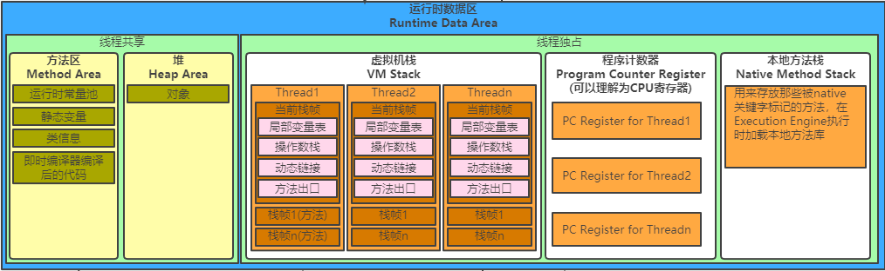
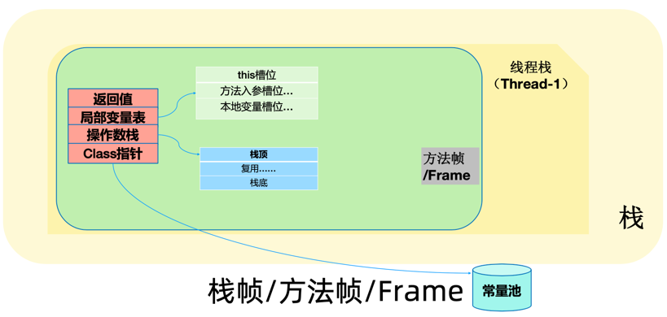

## Java内存模型

## Java内存结构？(运行时数据区域)

### 堆:
1. 产生时期: 堆是运行时数据区域，所有类实例和数组的内存均从此处分配。堆是在 Java 虚拟机启动时创建的。
2. 类别:
    - 堆: 
    - 非堆: 在JVM中堆之外的内存称为非堆内存(Non-heap memory)
3. 作用:
    - 堆: Java代码可及的内存，是留给开发人员使用的；
    - 非堆: 非堆就是JVM留给 自己用的，方法区、JVM内部处理或优化所需的内存(如JIT编译后的代码缓存)、每个类结构(如运行时常数池、字段和方法数据)以及方法和构造方法 的代码都在非堆内存中。
4. 存储内容:
    1. java代码中所有的new操作
### 2. 栈
 
1. 产生时期: 线程创建时产生,方法执行时生成栈帧
2. 类别:
    1. 虚拟机栈: 运行编译的Class文件 Method方法。
    2. 本地方法栈: 运行Native类型的方法，调用C/C++等外部程序接口方法。
#### 虚拟机栈(Java Virtual Machine Stacks)
- Java虚拟机栈也是线程私有的，生命周期与线程相同。Java虚拟机栈描述Java方法执行的内存模型: 每个方法都在执行的同时会创建一个栈帧(Stack Frame),
- 用于存储局部变量表、操作数栈、动态链接、方法出口等信息。
- 局部变量表存放编译期可知的基本数据类型、对象引用类型、returnAddress类型(指向了一条字节码指令的地址)，局部变量表所需内存空间在编译期完成分配。
1. 方法帧的组成及作用：
   1. 返回值：正常逻辑: return, 无返回值: Void
   2. 局部变量表
      1. this 槽位: 实例方法会有this槽位，非实例方法(static)无this槽位
      2. 方法入栈槽位: 入参变量
      3. 本地变量槽位: 方法中定义的变量
   3. 操作数栈: (Jvm 真正操作执行的地方)
      1. 栈顶
      2. 复用
      3. 栈底
   4. Class指针: 
      1. 常量池: 包含类名(字符串)、方法名(字符串)
      2. 标量(): 指针指向具体的地方
### 方法区: 
1. 特性:
    1. 方法区属于堆中永久区(PremGen)的一部分
    2. 永久区 几乎不会被GC垃圾回收
    3. JDK8无永久区，存在Meta Space元空间，直接使用物理内存
### 程序计数器
1. 当前线程所执行的字节码的行号指示器。
2. 字节码解释器工作时就是通过改变程序计数器的值来选取下一条需要执行的字节码指令，分支、循环、跳转、异常处理、线程恢复等功能都需要依赖这个计数器来完成。
  java虚拟机的多线程是通过线程轮流奇幻并分配处理器执行时间的方式来实现的，在任何一个确定的时刻，一个处理器(对于多核处理器来说是一个内核)都会执行一条线程中的指令，
  因此，为了线程切换后能恢复到正确的执行位置，每天线程都需要创建一个独立的程序计数器，各线程之间的计数器互不影响，独立存储。
- 注意: 执行的是native方法，计数器值为空，此内存区域是唯一在Java虚拟机规范中没有规定任何OutOfMemoryError情况的区域

- 官方文档参考: https://docs.oracle.com/javase/specs/jvms/se8/html/jvms-2.html#jvms-2.5