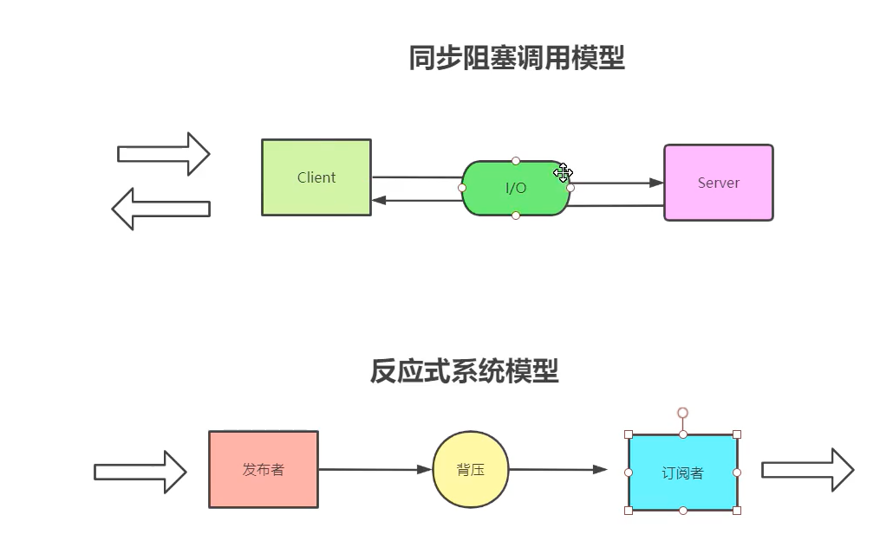

## Reactive Programming (响应式编程)
Reactive 异步非阻塞响应式框架, 它具有低延迟、高吞吐的特点。

- 传统的模型 ，client 不管有多少信息都会一次性发给server，这个时候如果Server性能够，可以能会造成大量的客户端请求无法响应，之后就会拒绝请求和请求失败
- 而响应式的模型有一个东西叫做 背压，需要数据，可以通过背压去控制数量，这样就不会让大量的数据冲垮我们的服务器
  

### Question
1. 什么是响应式？
    - 响应式处理是一种范例，它使开发人员能够构建可以处理背压（流控制）的非阻塞、异步应用程序。
2. 为什么需要响应式
    - 反应式系统更好地利用现代处理器。此外，在反应式编程中包含背压可确保解耦组件之间具有更好的弹性。
3. 有关响应式系统特质的论文
    - https://www.reactivemanifesto.org/zh-CN
4. Reactor 核心库
    - Project Reactor 是一个完全无阻塞的基础，包括背压支持。它是 Spring 生态系统中响应式堆栈的基础，并在 Spring WebFlux、Spring Data 和 Spring Cloud Gateway 等项目中具有特色。

- CSDN 博客: https://blog.csdn.net/doomwatcher/article/details/121938635?spm=1001.2101.3001.6661.1&utm_medium=distribute.pc_relevant_t0.none-task-blog-2%7Edefault%7ECTRLIST%7ERate-1-121938635-blog-129099794.235%5Ev38%5Epc_relevant_sort_base1&depth_1-utm_source=distribute.pc_relevant_t0.none-task-blog-2%7Edefault%7ECTRLIST%7ERate-1-121938635-blog-129099794.235%5Ev38%5Epc_relevant_sort_base1&utm_relevant_index=1
- CSDN 博客: https://blog.csdn.net/qq_32907491/article/details/129099794