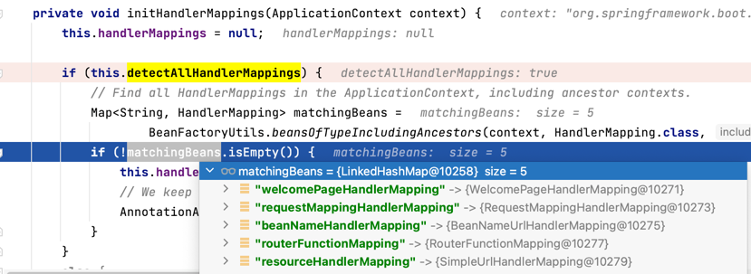

## Spring MVC 的工作原理
1. 路径映射: 用户请求 ->  前端控制器 DispatcherServlet 中央处理器 -> HandlerMapping 处理映射器 获取Handler (获取配置或注解，路径映射获取Handler)(HandlerExecutionChain)
2. 请求执行: 获取HandlerAdapter请求执行Handler -> HandlerAdapter根据Handler规则执行不同类型的请求 -> 执行完毕，返回ModelAndView
3. 视图解析: 返回View -> ViewResolver 视图解析器，将逻辑视图解析成真正的视图国际化处理(Freemarker 中存在 if...) -> 返回View
4. 页面渲染: 渲染视图将Model视图转为Response相应

### Spring Web Mvc 配置
1. WebMvcAutoConfiguration

### Spring 路径加载配置
1. EnableWebMvcConfiguration#createRequestMappingHandlerMapping 注册校验Spring MVC路径
   1. @Controller 注解继承 @Component，具备在Bean 注册时 AbstractHandlerMethodMapping#afterPropertiesSet
   2. AbstractHandlerMethodMapping#initHandlerMethods
   3. 通过 ApplicationContext 获取 BeanName 注册类，通过 isHandler 方法 判断类是否有 Controller 注解判断 注册其方法。
   4. 检测 bean 获取类方法 -> detectHandlerMethods
   5. 创建RequestMappingInfo -> createRequestMappingInfo
   6. 注册方法 registerHandlerMethod
   7. MappingRegistry#register 注册器注册
   8. 最后 RequestMappingHandlerMapping#afterPropertiesSet
### DispatherServlet 初始化过程
1. HttpServletBean#init 调用钩子回调方法 initServletBean，初始化Servlet Bean
2. FrameworkServlet 继承 HttpServletBean 类，并实现 initServletBean 回调方法
3. 处理FrameworkServlet#initServletBean时，调用初始化方法 initWebApplicationContext，并调用 onRefresh 回调方法
4. DispatcherServlet 类继承FrameworkServlet抽象类，并实现 onRefresh 回调钩子方法
5. DispatcherServlet#onRefresh方法，调用initStrategies 策略方法，初始化请求处理策略
6. 初始化本地化、请求匹配、请求适配器、请求异常处理等

### Spring 路径映射过程解析

1. HandlerMapping 处理类
   1. RequestMappingHandlerMapping
   2. 
2. 获取执行方法: AbstractHandlerMethodMapping#lookupHandlerMethod
    1. 获取路径: AbstractHandlerMethodMapping#initLookupPath
    2. 获取方法: AbstractHandlerMethodMapping#lookupHandlerMethod
3. 请求方式、路径、请求头、参数等匹配 RequestMappingInfo#getMatchingCondition 

### 实战扩展案例
1. 通用返回结果: ResponseBodyAdvice接口
2. 通用异常处理: