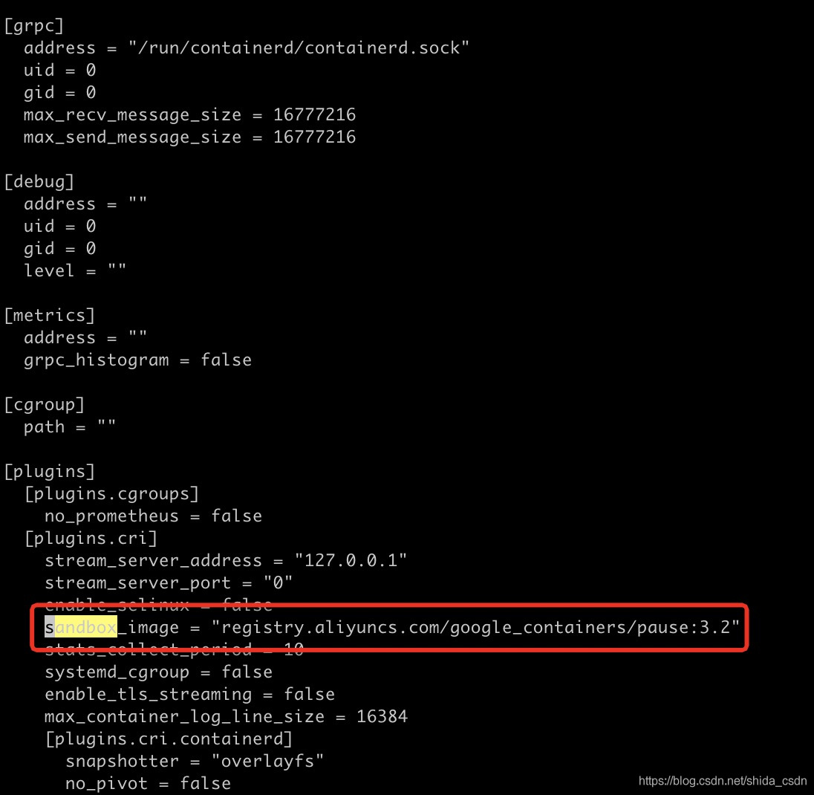

## Containerd Linux
1. Download Link: https://github.com/containerd/containerd/releases/download/v1.5.8/cri-containerd-cni-1.5.8-linux-amd64.tar.gz
2. 安装yum-utils、containerd
   ```shell
   yum install -y yum-utils
   yum-config-manager \
       --add-repo \
       https://download.docker.com/linux/centos/docker-ce.repo
   yum install containerd -y
   ```
3. 初始化 containerd 配置
   ```shell
   containerd config default > /etc/containerd/config.toml
   systemctl restart containerd
   systemctl status containerd
   ```
4. 替换 containerd 默认的 sand_box 镜像，编辑 /etc/containerd/config.toml
   ```
   sandbox_image = "registry.aliyuncs.com/google_containers/pause:3.6"
   ```
   
5. 重启containerd 服务
   ```shell
   systemctl daemon-reload
   systemctl restart containerd
   # 启动 containerd
   systemctl start containerd
   # 启用 containerd
   systemctl enable containerd
   ```
6. 安装 CRI 客户端 crictl
   ```shell
   yum install wget
   VERSION="v1.35.0"
   wget https://github.com/kubernetes-sigs/cri-tools/releases/download/$VERSION/crictl-$VERSION-linux-amd64.tar.gz
   sudo tar zxvf crictl-$VERSION-linux-amd64.tar.gz -C /usr/local/bin
   rm -f crictl-$VERSION-linux-amd64.tar.gz
   echo "runtime-endpoint: unix:///run/containerd/containerd.sock" > /etc/crictl.yaml
   ```
7. 测试 crictl
   ```shell
   crictl pull registry.aliyuncs.com/google_containers/pause:3.6
   crictl images
   ```
8. 安装runc
   ```shell
   RUNC_VERSION="1.4.0"
   ARCH="amd64"
   curl -LO https://github.com/opencontainers/runc/releases/download/v${RUNC_VERSION}/runc.${ARCH}
   sudo install -m 755 runc.${ARCH} /usr/local/sbin/runc
   ```
9. 安装CNI插件
   ```shell
   CNI_VERSION="1.9.0"
   curl -LO https://github.com/containernetworking/plugins/releases/download/v${CNI_VERSION}/cni-plugins-linux-${ARCH}-v${CNI_VERSION}.tgz
   sudo mkdir -p /opt/cni/bin
   sudo tar Cxzvf /opt/cni/bin cni-plugins-linux-${ARCH}-v${CNI_VERSION}.tgz
   ```
10. 安装nerdctl(containerd 与Docker兼容工具)
   ```shell
   NERDCTL_VERSION="2.2.1"
   ARCH="amd64"
   curl -LO https://github.com/containerd/nerdctl/releases/download/v${NERDCTL_VERSION}/nerdctl-${NERDCTL_VERSION}-linux-${ARCH}.tar.gz
   sudo tar Cxzvf /usr/local/bin nerdctl-${NERDCTL_VERSION}-linux-${ARCH}.tar.gz
   ```
11. 配置镜像加速
   ```shell
   # 创建目录
   mkdir /etc/containerd/certs.d/docker.io -pv

   # 配置加速器 (阿里云镜像加速: https://cr.console.aliyun.com/cn-shenzhen/instances/mirrors)
   cat > /etc/containerd/certs.d/docker.io/hosts.toml << EOF
   server = "https://docker.io"
   [host."https://i2mwuct0.mirror.aliyuncs.com"]
     capabilities = ["pull", "resolve"]
   EOF
   
   # 生成配置文件
   cat > /etc/crictl.yaml <<EOF
   runtime-endpoint: unix:///run/containerd/containerd.sock
   image-endpoint: unix:///run/containerd/containerd.sock
   timeout: 10
   debug: false
   EOF
   
   # 重启生效
   systemctl daemon-reload
   systemctl enable --now containerd.service
   systemctl restart  containerd.service
   ```
## Containerd Windows
1. Download Link: https://github.com/containerd/containerd/releases/download/v1.5.8/cri-containerd-cni-1.5.8-windows-amd64.tar.gz
2. Generate Config
    ```shell
    .\containerd.exe config default | Out-File config.toml -Encoding ascii
    ```
3. 查看并修改 containerd 配置文件

4. 安装 Containerd