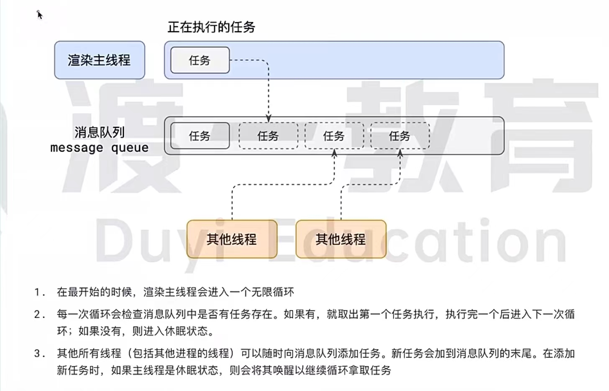

# Event Loop 事件循环

## 浏览器的进程模型
1. 浏览器有哪些进程和线程
    1. 浏览器是一个多进程、多线程的应用程序
    2. 目的：为避免互相影响，为减少连奔溃的几率，当启动浏览器后，它会自动启动多个进程。
    3. 进程：
        1. 浏览器进程
            1. 主要负责界面显示（前进、后退、刷新）、用户交换、子进程管理等，浏览器进程内部会启动多个线程处理不同任务
        2. 网络进程
            1. 负责加载网络资源。网络进程内部会启动多个线程来处理不同的网络任务
        3. 渲染进程(一个标签页一个渲染进程)(Chrome 后续会改为 Full Site Isolation (Site-per-process))
            1. 渲染进程启动后，会开启一个渲染主线程。主线程负责执行 HTML、CSS、JS代码

### 渲染主线程如何工作？
1. 主要任务：
   1. 解析HTML
   2. 解析CSS
   3. 计算样式 
   4. 布局（元素宽高）
   5. 处理图层 (z-index)
   6. 每秒把页面画60次 (fps 刷新率)
   7. 执行全局JS代码
   8. 执行事件处理函数
   9. 执行计时器回调函数
2. 任务队列(task queue -> message loop)
   

## JS异步
1. 如何理解JS的异步
> JS是一门单线程语言，这是因为它在运行浏览器器渲染主线程中，渲染线程只有一个，而渲染线程承担着诸多工作，渲染页面、执行JS都在其中运行。 
> 如果使用同步的方式就极有可能导致主线程产生阻塞，从而导致消息队列中很多其他任务无法得到执行。这样一来，一方面会导致繁忙的主线程白白的消耗时间，
> 另一方面导致页面无法及时更新，给用户造成卡死现象
>  所以浏览器采用异步的方式来避免,具体做法就是当某些任务发生时，比如计时器、网络、事件监听，主线程将任务交给其他线程去处理，自身立即结束任务的执行，
> 转而执行后续代码。当其他线程完成时，将事先传递的在这种异步模式下，浏览器用不阻塞，从而最大限度的保证了单线程的流畅运行。
2. JS为何会阻碍渲染

